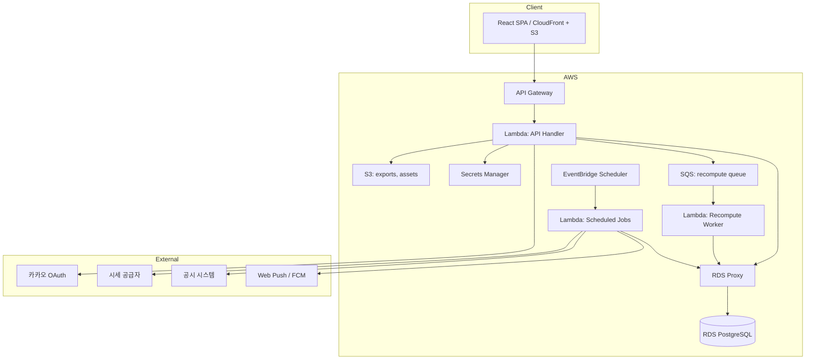

# 투자의 사계 — 백엔드 아키텍처 설계서

| 항목 | 내용 |
| --- | --- |
| 문서 성격 | 상세 설계 문서 (구현 기준) |
| 상위 문서 | [PRD](./PRD.md) |
| 선행 문서 | [데이터베이스 모델](./DATABASE-MODEL.md), [API 명세](./API-SPEC.md) |
| 기술 스택 | AWS Chalice (Python 3.12) / SQLModel / PostgreSQL (RDS) / Lambda + API Gateway |
| 범위 | 모듈 구조, 계층 규약, 도메인 엔진, 배치, 운영 |

---

## 목차

1. [아키텍처 원칙](#1-아키텍처-원칙)
2. [시스템 구성](#2-시스템-구성)
3. [계층 구조와 의존 규칙](#3-계층-구조와-의존-규칙)
4. [디렉토리 구조](#4-디렉토리-구조)
5. [모듈 경계](#5-모듈-경계)
6. [Chalice 애플리케이션 구성](#6-chalice-애플리케이션-구성)
7. [요청 처리 파이프라인](#7-요청-처리-파이프라인)
8. [스키마 계층](#8-스키마-계층)
9. [모델 계층](#9-모델-계층)
10. [리포지토리 계층](#10-리포지토리-계층)
11. [서비스 계층](#11-서비스-계층)
12. [도메인 계층 — 계산 엔진](#12-도메인-계층--계산-엔진)
13. [배치와 스케줄](#13-배치와-스케줄)
14. [외부 연동](#14-외부-연동)
15. [데이터베이스 접속 관리](#15-데이터베이스-접속-관리)
16. [설정과 시크릿](#16-설정과-시크릿)
17. [오류 처리](#17-오류-처리)
18. [로깅과 관측성](#18-로깅과-관측성)
19. [보안](#19-보안)
20. [테스트 전략](#20-테스트-전략)
21. [배포와 환경](#21-배포와-환경)
22. [성능 설계](#22-성능-설계)
23. [확장 대비](#23-확장-대비)

---

## 1. 아키텍처 원칙

| # | 원칙 | 귀결 |
| --- | --- | --- |
| 1 | **계산 로직은 프레임워크와 DB를 모른다** | `domain/` 패키지는 Chalice·SQLModel·psycopg를 import하지 않는다. 4개 계좌 계산은 순수 함수이며 입력만 주면 어디서든 같은 결과를 낸다. PRD 7장의 핵심 산출물을 단위 테스트로 검증할 수 있는 유일한 구조다 |
| 2 | **파생 데이터는 언제나 재생성 가능하다** | 계좌·지표는 원본 입력에서 결정론적으로 재계산된다. 정정 허용(PRD 3.5)과 계산 방식 변경 시 소급 재계산(PRD 19.7)이 동시에 요구되기 때문이다 |
| 3 | **규칙은 설정과 데이터로 표현한다** | 조정 로직·수수료·기준 건수·조건 선택지가 코드 상수로 존재하지 않는다 (PRD 19.1, 19.5) |
| 4 | **운영자 개입 없이 굴러간다** | 모든 배치는 멱등이고 자동 재시도되며, 실패는 사람이 아니라 경보가 먼저 안다. PRD 3.1의 "운영자가 매일 해야 하는 일 0"이 아키텍처 요구사항이다 |
| 5 | **응답 문구를 서버가 통제한다** | 규제·톤 규칙(PRD 17장)이 클라이언트 구현에 흩어지지 않도록 문구 생성 책임을 서버에 둔다 |
| 6 | **모듈은 도메인으로 나눈다** | `api/`, `service/`, `model/`로만 나누면 파일이 커질수록 도메인 경계가 사라진다. 각 계층 안에서 다시 도메인별로 분할한다 |
| 7 | **Lambda 제약을 설계에 반영한다** | 콜드 스타트, 커넥션 한계, 15분 실행 제한, 상태 없음을 전제로 모듈 로딩과 배치 분할을 설계한다 |

---

## 2. 시스템 구성



### 2.1 컴포넌트 책임

| 컴포넌트 | 책임 | 근거 |
| --- | --- | --- |
| API Handler Lambda | 동기 요청 처리 | Chalice 기본 배포 단위 |
| Scheduled Jobs Lambda | 일별 수집·판정·평가·알림 | Chalice `@app.schedule`이 별도 Lambda로 생성됨. API와 메모리·타임아웃을 다르게 설정 |
| Recompute Worker Lambda | 계좌 리플레이 | 매매 정정 시 동기 처리하면 응답이 느려진다. 큐로 분리하고 진행 상태를 API로 노출 |
| RDS Proxy | 커넥션 풀링 | Lambda 동시 실행 수만큼 커넥션이 열리면 RDS가 먼저 죽는다 |
| SQS | 재계산 작업 큐 | 재시도·DLQ를 인프라가 담당 |
| S3 | 내보내기 파일, 정적 자산 | |
| Secrets Manager | DB 자격증명, 카카오 키, JWT 서명키 | |

### 2.2 Lambda 분리 기준

| 함수 | 메모리 | 타임아웃 | 동시성 |
| --- | --- | --- | --- |
| API Handler | 512MB | 29초 (API Gateway 상한) | 예약 없음 |
| Daily Ingest | 1024MB | 5분 | 1 (중복 실행 방지) |
| Condition Eval | 1024MB | 10분 | 1 |
| Rebalance / Settlement | 1536MB | 15분 | 1 |
| Notification Dispatch | 512MB | 5분 | 1 |
| Recompute Worker | 1024MB | 5분 | 5 |

> **결산일 배치가 가장 무겁다.** 전 사용자가 같은 날 결산되기 때문이다 (PRD 8.6). 15분 안에 끝나지 않을 규모가 되면 사용자 배치를 청크로 나눠 SQS로 팬아웃하는 구조로 전환한다 (§13.5).

---

## 3. 계층 구조와 의존 규칙

```
┌──────────────────────────────────────────────┐
│  api/          라우팅·직렬화·HTTP 관심사        │
├──────────────────────────────────────────────┤
│  schemas/      요청·응답 DTO (Pydantic)        │
├──────────────────────────────────────────────┤
│  services/     유스케이스 오케스트레이션         │
├───────────────────────┬──────────────────────┤
│  repositories/        │  domain/             │
│  영속화·쿼리           │  순수 계산 로직        │
├───────────────────────┴──────────────────────┤
│  models/       SQLModel 테이블 정의            │
├──────────────────────────────────────────────┤
│  db/, common/, config/, integrations/         │
└──────────────────────────────────────────────┘
```

### 3.1 의존 방향 규칙

| 계층 | import 허용 | import 금지 |
| --- | --- | --- |
| `api` | `schemas`, `services`, `common`, `config` | `models`, `repositories`, `domain` 직접 사용 |
| `schemas` | `common`, `models`(열거형만) | `services`, `repositories` |
| `services` | `repositories`, `domain`, `models`, `integrations`, `common` | `api`, `schemas`(응답 조립은 api에서) |
| `repositories` | `models`, `db`, `common` | `services`, `domain`, `api` |
| `domain` | `common`(순수 유틸만) | **모든 것.** SQLModel·Chalice·boto3 금지 |
| `integrations` | `common`, `config` | `services`, `repositories` |
| `jobs` | `services`, `common` | `repositories` 직접 사용 |

**강제 수단**: `import-linter` 계약을 CI에서 실행한다. 위반 시 빌드 실패.

> **`services`가 `schemas`를 모르는 이유**: 서비스는 도메인 객체·dataclass를 반환하고, HTTP 응답 형태로의 변환은 `api` 계층이 담당한다. 그래야 같은 서비스를 배치 잡에서 재사용할 수 있다. 내부 배치 API(§13.4)와 스케줄 핸들러가 동일 서비스를 호출하는 구조가 여기서 나온다.

### 3.2 데이터 흐름 예시 — 매매 기입

```
POST /v1/trades
  → api/v1/trades.py           요청 파싱, 인증 컨텍스트 추출
  → schemas/trade.py           TradeCreateRequest 검증
  → services/trading_service.py
      ├ repositories/cycle_repo   사이클 상태 확인
      ├ repositories/market_repo  개장일·시세 확인
      ├ domain/rules/trade_rules  기입 가능 여부 판정 (순수)
      ├ repositories/trade_repo   trade + hypothesis 저장
      ├ domain/accounting/ledger  FREE 계좌 원장 생성 (순수)
      ├ repositories/account_repo 원장·포지션 반영
      └ services/notification_service  (없음 — 매매는 알림 대상 아님)
  → api/v1/trades.py           TradeResponse 조립 + 봉투 래핑
```

---

## 4. 디렉토리 구조

```
backend/
├── app.py                          # Chalice 엔트리포인트. 블루프린트 등록만
├── requirements.txt                # Lambda 배포 의존성
├── requirements-dev.txt            # 개발·테스트 의존성
├── .chalice/
│   ├── config.json                 # 스테이지별 설정
│   └── policy-prod.json            # IAM 정책 (자동 생성 비활성)
├── migrations/                     # Alembic
│   ├── env.py
│   ├── versions/
│   └── seeds/                      # 시드 데이터 마이그레이션
├── chalicelib/
│   ├── __init__.py
│   │
│   ├── config/
│   │   ├── settings.py             # 환경변수 → 설정 객체 (Pydantic Settings)
│   │   ├── constants.py            # 변하지 않는 상수만 (열거 라벨 등)
│   │   └── logging_config.py
│   │
│   ├── common/
│   │   ├── errors.py               # 도메인 예외 정의
│   │   ├── error_codes.py          # API 오류 코드 ↔ 예외 매핑
│   │   ├── decimal_utils.py        # NUMERIC 안전 연산
│   │   ├── clock.py                # 시간 추상화 (테스트 주입)
│   │   ├── kst.py                  # KST 날짜 유틸
│   │   ├── pagination.py           # 커서 인코딩
│   │   ├── idempotency.py
│   │   └── types.py                # 공통 타입 별칭
│   │
│   ├── db/
│   │   ├── engine.py               # SQLAlchemy 엔진 (Lambda 최적화)
│   │   ├── session.py              # 세션 팩토리·컨텍스트
│   │   └── unit_of_work.py         # 트랜잭션 경계
│   │
│   ├── models/                     # SQLModel 테이블
│   │   ├── base.py                 # 공통 믹스인 (id, timestamps)
│   │   ├── enums.py                # 전 도메인 열거형
│   │   ├── user.py
│   │   ├── market.py
│   │   ├── portfolio.py            # cycle, account, position, ledger, snapshot, rebalance
│   │   ├── trading.py              # trade, hypothesis, condition, trigger, review, deviation
│   │   ├── journal.py
│   │   ├── principle.py
│   │   ├── settlement.py           # metric, report, prediction, emergency, badge
│   │   ├── practice.py
│   │   ├── notification.py
│   │   └── system.py
│   │
│   ├── repositories/
│   │   ├── base.py                 # 공통 CRUD·커서 페이지네이션
│   │   ├── user_repo.py
│   │   ├── market_repo.py
│   │   ├── calendar_repo.py
│   │   ├── stock_pool_repo.py
│   │   ├── cycle_repo.py
│   │   ├── account_repo.py
│   │   ├── ledger_repo.py
│   │   ├── trade_repo.py
│   │   ├── hypothesis_repo.py
│   │   ├── condition_repo.py
│   │   ├── review_repo.py
│   │   ├── deviation_repo.py
│   │   ├── journal_repo.py
│   │   ├── insight_repo.py
│   │   ├── principle_repo.py
│   │   ├── metric_repo.py
│   │   ├── report_repo.py
│   │   ├── practice_repo.py
│   │   ├── notification_repo.py
│   │   └── system_repo.py
│   │
│   ├── domain/                     # 순수 계산 (외부 의존 없음)
│   │   ├── values.py               # Money, Rate, Quantity 값 객체
│   │   ├── accounting/
│   │   │   ├── cost.py             # 수수료·세금·체결오차
│   │   │   ├── ledger_builder.py   # 원장 항목 생성
│   │   │   ├── position_calc.py    # 평균단가·실현손익
│   │   │   └── valuation.py        # 평가·수익률
│   │   ├── engines/
│   │   │   ├── replay.py           # 계좌 리플레이 오케스트레이터
│   │   │   ├── free_track.py       # 자유 투자 계좌
│   │   │   ├── rule_track.py       # 규칙 투자 계좌
│   │   │   ├── plan_track.py       # 내 계획대로 계좌
│   │   │   ├── hold_track.py       # 그냥 둔 계좌
│   │   │   ├── condition_eval.py   # 조건 도달 판정
│   │   │   ├── rebalance.py        # 하위 2종목 선정·재분배
│   │   │   ├── corporate_action.py # 거래정지·상폐·분할 처리
│   │   │   └── deviation_detect.py # 항목별 내역 판정
│   │   ├── calendar/
│   │   │   ├── trading_day.py      # 개장일 계산
│   │   │   └── cycle_schedule.py   # 조정일·결산일 산출
│   │   ├── metrics/
│   │   │   ├── performance.py      # 수익률·세 개의 차이
│   │   │   ├── adherence.py        # 두 준수율 (분리 계산)
│   │   │   ├── mood_analysis.py
│   │   │   └── sample_gate.py      # 기준 건수 판정
│   │   ├── report/
│   │   │   ├── report_builder.py   # 레슨 페이로드 조립
│   │   │   └── candidate_picker.py # 잘한/아쉬운 판단 후보
│   │   ├── principles/
│   │   │   ├── template_filler.py  # 문장 틀 치환
│   │   │   └── scorecard.py
│   │   ├── practice/
│   │   │   └── session_calc.py
│   │   └── statements/
│   │       ├── catalog.py          # 문구 템플릿 정의
│   │       └── renderer.py         # StatementBlock 생성
│   │
│   ├── services/
│   │   ├── auth_service.py
│   │   ├── user_service.py
│   │   ├── onboarding_service.py
│   │   ├── market_service.py
│   │   ├── stock_pool_service.py
│   │   ├── cycle_service.py
│   │   ├── account_service.py
│   │   ├── rebalance_service.py
│   │   ├── trading_service.py
│   │   ├── hypothesis_service.py
│   │   ├── condition_service.py
│   │   ├── review_service.py
│   │   ├── journal_service.py
│   │   ├── insight_service.py
│   │   ├── principle_service.py
│   │   ├── prediction_service.py
│   │   ├── emergency_service.py
│   │   ├── badge_service.py
│   │   ├── practice_service.py
│   │   ├── settlement_service.py
│   │   ├── retrospective_service.py
│   │   ├── report_service.py
│   │   ├── notification_service.py
│   │   ├── export_service.py
│   │   └── recompute_service.py
│   │
│   ├── schemas/
│   │   ├── envelope.py             # 표준 응답 봉투
│   │   ├── common.py               # Money, RateMetric, RecallBlock 등
│   │   ├── pagination.py
│   │   ├── auth.py
│   │   ├── user.py
│   │   ├── onboarding.py
│   │   ├── market.py
│   │   ├── cycle.py
│   │   ├── account.py
│   │   ├── rebalance.py
│   │   ├── trade.py
│   │   ├── condition.py
│   │   ├── review.py
│   │   ├── journal.py
│   │   ├── insight.py
│   │   ├── principle.py
│   │   ├── settlement.py
│   │   ├── practice.py
│   │   ├── notification.py
│   │   └── export.py
│   │
│   ├── api/
│   │   ├── __init__.py             # 블루프린트 목록 export
│   │   ├── context.py              # RequestContext (user, request_id)
│   │   ├── deps.py                 # 인증·사이클 추출 헬퍼
│   │   ├── responses.py            # 봉투 래핑·페이지네이션 메타
│   │   ├── notices.py              # meta.notice 부착 규칙
│   │   ├── middleware/
│   │   │   ├── request_context.py
│   │   │   ├── db_session.py
│   │   │   ├── error_handler.py
│   │   │   ├── auth.py
│   │   │   └── idempotency.py
│   │   └── v1/
│   │       ├── auth.py
│   │       ├── users.py
│   │       ├── onboarding.py
│   │       ├── market.py
│   │       ├── stock_pools.py
│   │       ├── stocks.py
│   │       ├── cycles.py
│   │       ├── accounts.py
│   │       ├── rebalances.py
│   │       ├── trades.py
│   │       ├── hypotheses.py
│   │       ├── conditions.py
│   │       ├── reviews.py
│   │       ├── journals.py
│   │       ├── insights.py
│   │       ├── principles.py
│   │       ├── predictions.py
│   │       ├── emergency.py
│   │       ├── badges.py
│   │       ├── practice.py
│   │       ├── settlements.py
│   │       ├── reports.py
│   │       ├── notifications.py
│   │       ├── exports.py
│   │       └── internal.py
│   │
│   ├── integrations/
│   │   ├── kakao/
│   │   │   ├── client.py
│   │   │   └── dto.py
│   │   ├── market_data/
│   │   │   ├── protocol.py         # PriceProvider Protocol
│   │   │   ├── primary.py
│   │   │   ├── fallback.py
│   │   │   └── normalizer.py
│   │   ├── disclosure/
│   │   │   ├── protocol.py
│   │   │   └── client.py
│   │   ├── push/
│   │   │   ├── protocol.py
│   │   │   └── webpush.py
│   │   └── storage/
│   │       └── s3.py
│   │
│   └── jobs/
│       ├── base.py                 # 잡 실행 래퍼 (ingestion_run 기록)
│       ├── ingest_price.py
│       ├── ingest_disclosure.py
│       ├── ingest_market.py
│       ├── ingest_earnings_schedule.py
│       ├── evaluate_conditions.py
│       ├── run_rebalance.py
│       ├── revalue_accounts.py
│       ├── run_settlement.py
│       ├── dispatch_notifications.py
│       ├── enqueue_periodic_review.py
│       ├── notify_next_cycle_open.py
│       ├── process_recompute.py
│       └── housekeeping.py
│
└── tests/
    ├── conftest.py
    ├── factories/
    ├── unit/
    │   ├── domain/
    │   └── common/
    ├── integration/
    │   ├── repositories/
    │   └── services/
    ├── api/
    └── scenarios/                  # PRD 시나리오 기반 종단 테스트
```

---

## 5. 모듈 경계

각 도메인 모듈은 **모델·리포지토리·서비스·API·스키마**를 관통하는 수직 슬라이스로 이해한다. 파일은 계층별 디렉토리에 있지만, 소유권은 도메인에 있다.

| 도메인 | 소유 테이블 | 주요 서비스 | 다른 도메인 접근 |
| --- | --- | --- | --- |
| `accounts`(사용자) | user, identity, setting, survey, token | auth, user | 없음 |
| `market` | stock, pool, price, disclosure, index, flow, calendar | market, stock_pool | 없음 |
| `portfolio` | cycle, account, position, ledger, snapshot, rebalance | cycle, account, rebalance | market(읽기) |
| `trading` | trade, hypothesis, condition, trigger, review, deviation | trading, condition, review | portfolio(계좌 반영), market(시세) |
| `journal` | journal, item, insight, streak | journal, insight | trading(회고 출처) |
| `principle` | principle, trigger_point, encounter, template | principle | journal(insight), settlement(지표) |
| `settlement` | metric, report, prediction, emergency, badge | settlement, report, badge | 전 도메인(읽기) |
| `practice` | scenario, session, decision | practice | 없음 |
| `notification` | notification, device, preference | notification | 전 도메인(발신 요청) |
| `system` | config, ingestion_run, recompute_job, export_job, audit | recompute, export | 없음 |

### 5.1 도메인 간 호출 규칙

| 규칙 | 내용 |
| --- | --- |
| 서비스 → 서비스 호출 허용 | 단 순환 금지. 순환이 필요하면 이벤트로 분리 |
| 리포지토리 교차 접근 금지 | `trading_service`가 `account_repo`를 직접 쓰지 않고 `account_service`를 호출한다 |
| 예외 | 읽기 전용 조회는 리포지토리 직접 접근 허용 (성능). 쓰기는 항상 소유 서비스 경유 |
| `settlement`의 쓰기 범위 | **자기 소유 테이블(`cycle_metric`, `cycle_report`, `cycle_retrospective`)에만 직접 쓴다.** 다른 도메인의 상태 변경 — 결산 전량 매도(`portfolio`), 사이클 종료 전이(`portfolio`), 수칙 확정(`principle`) — 은 반드시 해당 도메인 서비스를 호출해 수행한다 |

> 결산은 여러 도메인을 건드리는 유일한 유스케이스이며, 그래서 경계를 가장 엄격히 지켜야 한다. `settlement_service`가 `account_ledger`에 직접 쓰기 시작하면 청산 로직이 두 곳에 생기고, 재실행 시 어느 쪽이 실행됐는지 알 수 없게 된다.

### 5.2 도메인 이벤트

MVP에서는 메시지 브로커를 도입하지 않고 **서비스 내 동기 호출 + 명시적 후속 작업 등록**으로 처리한다.

| 사건 | 후속 작업 | 처리 |
| --- | --- | --- |
| 매매 정정·삭제 | 계좌 리플레이 | `recompute_job` 등록 → SQS |
| 조건 도달 | PLAN 계좌 집행 + 알림 예약 | 같은 배치 트랜잭션 내 |
| 회고 4번 문항 입력 | insight 생성 | 같은 트랜잭션 |
| 수칙 노출 | encounter 기록 | API 응답 조립 시 비동기 기록 |
| 결산 완료 | 리포트 생성 + 알림 | 배치 내 순차 |

---

## 6. Chalice 애플리케이션 구성

### 6.1 app.py의 역할

`app.py`는 **Chalice 인스턴스 생성, 미들웨어 등록, 블루프린트 등록, 스케줄 핸들러 선언**만 담당한다. 비즈니스 로직이 한 줄도 들어가지 않는다.

| 요소 | 내용 |
| --- | --- |
| `Chalice(app_name)` | 앱 인스턴스 |
| `app.register_middleware(...)` | §7 순서대로 |
| `app.register_blueprint(bp, url_prefix='/v1/...')` | `api/v1/*`의 블루프린트 |
| `@app.schedule(Cron(...))` | 스케줄 핸들러. 본문은 `jobs/*` 호출 1줄 |
| `@app.on_sqs_message(queue=...)` | 재계산 워커 |
| `app.api.cors` | 스테이지별 CORS 설정 |

### 6.2 블루프린트 분할

Chalice의 `Blueprint`를 도메인 단위로 사용한다. 이것이 Chalice에서 라우트를 모듈화하는 유일한 공식 수단이며, 이를 쓰지 않으면 `app.py`가 200개 라우트를 가진 단일 파일이 된다.

| 규칙 | 내용 |
| --- | --- |
| 파일당 블루프린트 1개 | `api/v1/trades.py` → `trades_bp` |
| URL 접두 | 등록 시점에 지정. 블루프린트 내부는 상대 경로 |
| 공통 의존 | `deps.py`의 헬퍼를 각 핸들러에서 호출 |
| 핸들러 길이 | 20줄 이내. 파싱 → 서비스 호출 → 응답 조립만 |

### 6.3 CORS와 API Gateway

| 항목 | 설정 |
| --- | --- |
| CORS 허용 출처 | 스테이지별 프론트엔드 도메인. `*` 금지 |
| 허용 헤더 | `Authorization`, `Content-Type`, `Idempotency-Key`, `X-Client-Version` |
| 노출 헤더 | `X-Request-Id`, `Retry-After` |
| 인증 | 애플리케이션 미들웨어에서 처리. API Gateway Authorizer를 쓰지 않는다 (추가 Lambda 콜드스타트 회피) |
| 바이너리 응답 | 사용하지 않음. 내보내기는 S3 presigned URL |
| 요청 크기 | 1MB 제한 |

---

## 7. 요청 처리 파이프라인

Chalice 미들웨어는 **등록 역순으로 감싸진다.** 아래 순서로 등록하여 바깥에서 안쪽으로 실행되게 한다.

| 순서 | 미들웨어 | 책임 |
| --- | --- | --- |
| 1 | `request_context` | `request_id` 생성, 로깅 컨텍스트 바인딩, 처리 시간 측정 |
| 2 | `error_handler` | 도메인 예외 → 표준 오류 응답 변환. 미처리 예외 → 500 + 알람 |
| 3 | `db_session` | 세션 생성, 성공 시 커밋, 예외 시 롤백, 항상 종료 |
| 4 | `auth` | JWT 검증, `RequestContext.user` 주입. 공개 라우트는 통과 |
| 5 | `idempotency` | POST 요청의 `Idempotency-Key` 확인·기록 |

### 7.1 RequestContext

| 필드 | 설명 |
| --- | --- |
| `request_id` | ULID |
| `user_id` | 인증 사용자 |
| `session` | DB 세션 |
| `now` | 요청 시각 (Clock 주입, 테스트에서 고정) |
| `client_version` | |
| `idempotency_key` | |

컨텍스트는 Chalice의 `app.current_request.context`가 아닌 **명시적 컨텍스트 객체**로 전달한다. 전역 변수를 쓰면 Lambda 컨테이너 재사용 시 이전 요청 상태가 남는다.

### 7.2 인증 흐름

| 단계 | 처리 |
| --- | --- |
| 1 | `Authorization: Bearer` 헤더 파싱 |
| 2 | JWT 서명 검증 (HS256, Secrets Manager의 키. 캐시) |
| 3 | 만료·발급자 확인 |
| 4 | `sub`에서 `user_id` 추출. **DB 조회하지 않는다** (매 요청 조회는 낭비) |
| 5 | 사용자 상태 확인이 필요한 라우트만 `deps.require_active_user()` 호출 |

토큰 페이로드: `sub`(user_id), `iat`, `exp`, `jti`, `ver`(토큰 스키마 버전).

### 7.3 인가

**모든 사용자 소유 리소스 조회에 소유자 검증을 강제한다.** 리포지토리 레벨에서 `user_id` 조건을 필수 인자로 받는 시그니처를 쓴다. 서비스가 실수로 빼먹을 수 없게 하는 것이 목적이다.

소유자 불일치 시 403이 아니라 **404**를 반환한다 (리소스 존재 은닉).

### 7.4 멱등성

| 항목 | 처리 |
| --- | --- |
| 대상 | 모든 POST |
| 저장 | `idempotency_record` 테이블 (PostgreSQL). `(user_id, key)` 유니크 + 응답 스냅샷, 24시간 후 만료 |
| 동일 키 + 동일 본문 재요청 | 저장된 응답 그대로 반환 (200/201 유지) |
| 동일 키 + 다른 본문 | 409 `IDEMPOTENCY_CONFLICT` (`request_fingerprint` 불일치) |
| 처리 중 재요청 | 409 `IDEMPOTENCY_CONFLICT` |
| 키 누락 | 400. 단 개발 스테이지에서는 경고만 |
| 만료 정리 | `housekeeping` 배치 |

DynamoDB를 쓰지 않는 이유는 스택을 하나 더 늘리는 운영 비용이 이 규모에서 이득보다 크기 때문이다. 유니크 제약 충돌이 곧 중복 감지이므로 별도 락도 필요 없다.

> 확인 버튼(`POST /rebalances/{id}/confirm`)과 매매 기입이 가장 중요한 대상이다. 네트워크 재시도로 매매가 두 번 기입되면 계좌가 틀어지고, 사용자는 정정 요청을 하게 된다 — PRD 3.5가 줄이려는 문의 유형이다.

### 7.5 응답 조립

`api/responses.py`가 봉투 래핑을 전담한다.

| 함수 | 용도 |
| --- | --- |
| `ok(data, notices=None, as_of=None)` | 단건 |
| `ok_list(items, pagination, ...)` | 목록 |
| `created(data, location)` | 201 |
| `accepted(job_ref)` | 202 |
| `no_content()` | 204 |

`meta.notice`는 `api/notices.py`의 **라우트별 고지 규칙 테이블**에서 자동 부착한다. 핸들러가 매번 고지를 기억해 붙이는 방식은 누락되며, 누락된 고지는 규제 리스크다 (PRD 17장).

---

## 8. 스키마 계층

### 8.1 Pydantic v2 사용 방침

| 항목 | 규약 |
| --- | --- |
| 요청 DTO | `<Domain><Action>Request` (예: `TradeCreateRequest`) |
| 응답 DTO | `<Domain>Response`, `<Domain>ListItem` |
| 내부 전달 | `dataclass` 또는 도메인 값 객체. Pydantic을 서비스 내부에 쓰지 않는다 |
| 금액·비율 | `Decimal` → 직렬화 시 문자열. 커스텀 serializer로 일괄 처리 |
| 열거값 | `models/enums.py`의 Enum 재사용 |
| 엄격 모드 | `model_config = ConfigDict(extra='forbid')` — 미지 필드는 400 |

### 8.2 공통 스키마

`schemas/common.py`가 API 명세 §6의 공통 객체를 구현한다.

| 클래스 | 대응 |
| --- | --- |
| `Money` | 금액 |
| `RateMetric` | 비율 지표. **`rate` 단독 생성자를 제공하지 않는다** — 분자·분모 없이는 만들 수 없다 |
| `PerformanceValue` | 성과 값. `as_of_date` 필수 필드 |
| `AccountSummary` | |
| `StockSummary` | |
| `ConditionObject` | |
| `RecallBlock` | |
| `StatementBlock` | |
| `Notice` | |

> `RateMetric`과 `PerformanceValue`의 **필수 필드 설계가 PRD 5.4·7.9의 표시 규칙을 타입 수준에서 강제**한다. 기준일 없는 성과 값을 만들 수 없고, 분모 없는 비율을 만들 수 없다.

### 8.3 검증 규칙 배치

| 검증 종류 | 위치 |
| --- | --- |
| 형식 (타입, 길이, 범위) | Pydantic 스키마 |
| 도메인 규칙 (개장일, 보유 수량, 한도) | 서비스 또는 domain/rules |
| 참조 무결성 | 리포지토리 조회 후 서비스 판단 |

형식 검증 실패는 `field_errors`로, 도메인 규칙 위반은 도메인 오류 코드로 반환한다 (API 명세 §3).

---

## 9. 모델 계층

### 9.1 SQLModel 사용 방침

| 항목 | 규약 |
| --- | --- |
| 테이블 모델 | `table=True`. DB 스키마와 1:1 |
| 응답 모델 | SQLModel을 응답에 직접 쓰지 않는다. 별도 Pydantic 스키마 사용 |
| 관계 | `Relationship`을 정의하되 **기본 lazy 로딩에 의존하지 않는다.** 필요한 조인을 리포지토리에서 명시 |
| 열거형 | `str` Enum + `sa_column=Column(String(32))` + CHECK 제약 |
| 기본값 | DB 기본값(`server_default`)과 파이썬 기본값을 함께 지정 |
| 공통 컬럼 | `TimestampMixin`, `IdentityPKMixin` |

### 9.2 관계 로딩 전략

Lambda 환경에서 N+1은 곧 타임아웃이다.

| 패턴 | 사용 |
| --- | --- |
| `selectinload` | 1:N 컬렉션 (사이클 → 계좌, 가설 → 조건) |
| `joinedload` | N:1 단일 (매매 → 종목) |
| 명시적 조인 | 목록 조회. ORM 객체 대신 필요한 컬럼만 |
| 지연 로딩 | 사용 금지. `lazy='raise'`로 설정하여 실수 시 즉시 예외 |

`lazy='raise'`는 개발 초기에 번거롭지만, 운영에서 조용히 느려지는 것보다 낫다.

### 9.3 Decimal 처리

| 항목 | 규약 |
| --- | --- |
| 컬럼 | `NUMERIC(p, s)` |
| 파이썬 | `decimal.Decimal` |
| 연산 컨텍스트 | `common/decimal_utils.py`에서 전역 정밀도·반올림 설정 |
| 반올림 | `ROUND_HALF_UP`, 저장 시 컬럼 자릿수로 양자화 |
| float 변환 | **금지.** 린트 규칙으로 `float(` 호출을 금액 컨텍스트에서 차단 |

---

## 10. 리포지토리 계층

### 10.1 책임

| 하는 것 | 하지 않는 것 |
| --- | --- |
| 쿼리 작성, 결과 매핑 | 비즈니스 규칙 판단 |
| 커서 페이지네이션 | 트랜잭션 커밋 |
| 벌크 삽입·삭제 | 다른 도메인 테이블 조작 |
| 소유자 필터 강제 | 외부 API 호출 |

### 10.2 공통 베이스

`repositories/base.py`가 제공하는 것:

| 기능 | 설명 |
| --- | --- |
| `get(id, user_id)` | 소유자 검증 포함 단건 조회 |
| `list_by_cursor(...)` | 커서 페이지네이션 표준 구현 |
| `bulk_insert(...)` | 원장·스냅샷 대량 삽입 |
| `delete_range(...)` | 리플레이 시 파생 데이터 삭제 |

### 10.3 커서 페이지네이션 구현

| 항목 | 규약 |
| --- | --- |
| 커서 내용 | 정렬 키 + id (동값 안정성). base64 인코딩 |
| 정렬 | 항상 `(sort_key DESC, id DESC)` 복합 |
| 서명 | 커서에 HMAC 서명을 붙여 조작 방지 |
| 한계 | `limit + 1` 조회로 `has_next` 판정 |

### 10.4 쿼리 작성 규칙

| 규칙 | 내용 |
| --- | --- |
| 원시 SQL | 집계 성능이 필요한 경우만. `text()` + 바인드 파라미터. 문자열 결합 금지 |
| 인덱스 확인 | 새 쿼리 추가 시 `EXPLAIN` 결과를 PR에 첨부 |
| 전체 스캔 | 사용자 데이터 테이블에서 금지. 배치도 항상 날짜·상태로 좁힌다 |
| 트랜잭션 | 리포지토리는 flush만 하고 commit하지 않는다 |

---

## 11. 서비스 계층

### 11.1 서비스의 형태

각 서비스는 **함수 집합**으로 구성하고, 상태를 갖는 클래스를 만들지 않는다. 의존은 인자로 받는다(세션, 리포지토리, 클록, 외부 클라이언트).

| 항목 | 규약 |
| --- | --- |
| 시그니처 | `def create_trade(ctx: RequestContext, cmd: CreateTradeCommand) -> TradeResult` |
| 입력 | 커맨드 dataclass. Pydantic 스키마를 직접 받지 않는다 |
| 출력 | 결과 dataclass 또는 도메인 객체 |
| 예외 | `common/errors.py`의 도메인 예외 |
| 트랜잭션 | 서비스 진입점이 경계. 중첩 호출은 같은 세션 참여 |

### 11.2 주요 서비스 책임

| 서비스 | 핵심 유스케이스 |
| --- | --- |
| `auth_service` | 카카오 코드 교환, 사용자 생성·연결, 토큰 발급·회전 |
| `onboarding_service` | 단계 진행·재개, 6단계 일정 재계산, 7·8단계 원자성 보장 |
| `cycle_service` | 사이클 생성(계좌 4개 + 초기 배분), 재시작, 상태 전이, 일정 조회 |
| `trading_service` | 매매 기입(가설 포함), 정정·삭제, 기입 컨텍스트 조립 |
| `condition_service` | 조건 재설정, 자기 보고, 트리거 응답 기록 |
| `account_service` | 계좌 조회, 성과 조회, 재계산 요청 |
| `rebalance_service` | 조정 실행(배치), 확인 기록, 확인율 계산 |
| `settlement_service` | 결산 오케스트레이션 — 청산은 `account_service`, 상태 전이는 `cycle_service`에 위임 |
| `retrospective_service` | 사이클 회고 문항 제공·저장 (PRD 13.1-3) |
| `report_service` | 레슨 페이로드 조립, 후보 추출, 사용자 선택 반영 |
| `principle_service` | 후보 생성, 확정, 노출 기록, 성적표 |
| `notification_service` | 알림 생성·우선순위 적용·발송 |
| `recompute_service` | 리플레이 작업 등록·실행 |

### 11.3 사이클 생성 상세

PRD 7.3·18.5의 규칙이 집중된 지점이다.

| 단계 | 처리 |
| --- | --- |
| 1 | 오늘 기준 남은 정기 조정 횟수 산출 (`domain/calendar/cycle_schedule`) |
| 2 | `cycle_plan_rule`에서 시작 종목 수·축소 경로 조회 |
| 3 | 선택 종목 수 검증 (정확히 일치해야 함) |
| 4 | `cycle` 생성 (`status=PREPARING`, 남은 조정 횟수·시작 종목 수 스냅샷) |
| 5 | `cycle_stock_selection` 저장 (선택 이유 포함, `restart_generation=0`) |
| 6 | 계좌 4개 생성. **전부 `initial_capital=30,000,000`** |
| 7 | 4계좌 각각에 초기 균등 배분 원장 생성 (같은 종목·같은 수량) |
| 8 | `is_taster` 판정 (남은 조정 0회) |
| 9 | `DRAFT` 상태 임시 수칙이 있으면 `ACTIVE`로 전이하고 이 사이클에 연결 |
| 10 | 첫 가설 기록 완료 시 `status=ACTIVE`, `started_on` 확정 |

> 7단계에서 **네 계좌의 초기 상태가 완전히 동일해야 한다.** 수량 계산은 한 번만 수행하고 4계좌에 복사한다. 계좌별로 따로 계산하면 반올림 차이가 생겨 첫날부터 계좌 간 차이가 0이 아니게 된다.

**두 번째 사이클 이후의 시작**은 온보딩을 거치지 않는다 (PRD 16-B). `cycle_service.get_start_context()`가 확정 수칙·일정·종목 풀·지난 사이클 요약을 한 번에 반환하고, 이후 흐름은 위와 동일하다. 설문·연습·임시 수칙 단계는 최초 1회 전용이므로 재실행하지 않는다.

---

## 12. 도메인 계층 — 계산 엔진

**이 절이 이 시스템의 핵심이다.** PRD 7장의 4개 계좌 계산 규칙을 코드 구조로 옮긴다.

### 12.1 값 객체

| 객체 | 내용 |
| --- | --- |
| `Money` | Decimal 래퍼. 덧셈·뺄셈만 허용, float 연산 차단 |
| `Rate` | 비율. 퍼센트포인트 변환 메서드 제공 |
| `Quantity` | 수량. 음수 불가 |
| `PriceQuote` | 종가 + 기준일 쌍. **기준일 없는 가격을 만들 수 없다** |

### 12.2 비용 계산 (`accounting/cost.py`)

PRD 7.7의 순서를 그대로 구현한다.

| 단계 | 내용 | 적용 대상 |
| --- | --- | --- |
| 1 | 수수료 = 거래대금 × `commission_rate` | **4계좌 전부** |
| 2 | 매도세 = 매도대금 × `tax_rate_sell` | **4계좌 전부** |
| 3 | 체결 오차 = 종가 × `slippage_rate_virtual`를 **불리한 방향으로** | **가상 계좌(RULE/PLAN/HOLD)의 엔진 집행에만** |

**불리한 방향**의 정의: 매수는 종가보다 높게, 매도는 종가보다 낮게. 가상 계좌를 실제보다 좋아 보이게 만들지 않기 위함이다.

**적용 순서를 뒤집으면 안 된다.** 먼저 4계좌 공통 비용을 넣고, 그 위에 가상 계좌 체결 오차를 얹는다. 순서를 바꾸면 오차에 수수료가 붙는지 여부가 달라진다.

| 함수 | 시그니처 개념 |
| --- | --- |
| `apply_common_costs(side, quantity, price, config)` | → `CostBreakdown` |
| `apply_virtual_slippage(side, close_price, config)` | → `executed_price` |
| `resolve_config(trade_date)` | 거래일 시점의 유효 설정 (§16.3) |

### 12.3 리플레이 오케스트레이터 (`engines/replay.py`)

```
replay(cycle_input, from_date) →
  for each account_type in [RULE, FREE, PLAN, HOLD]:
      track = get_track_engine(account_type)
      events = track.generate_events(cycle_input, from_date)
      ledger = ledger_builder.build(events, cost_config)
      positions = position_calc.apply(ledger)
      snapshots = valuation.daily(positions, prices, calendar)
  → ReplayResult(ledgers, positions, snapshots)
```

| 특성 | 내용 |
| --- | --- |
| 순수성 | DB 접근 없음. 입력 `CycleReplayInput`은 서비스가 조립해 전달 |
| 결정론 | 같은 입력 → 같은 출력. 난수·현재 시각 사용 금지 |
| 부분 재계산 | `from_date` 이전 상태를 시작점으로 받아 그 이후만 생성 |
| 검증 | 골든 시나리오 테스트로 회귀 감지 (§20.3) |

**`CycleReplayInput` 구성**

| 필드 | 출처 |
| --- | --- |
| `cycle_config` | 초기 자본, 조정 일정, 결산일 |
| `initial_selection` | `cycle_stock_selection`의 최신 세대 종목 목록 |
| `trades` | `ACTIVE` 상태 매매 (시간순) |
| `conditions` | 가설 조건과 대응 |
| `prices` | 기간 내 일별 종가 (종목별) |
| `corporate_actions` | 기업행위 |
| `calendar` | 개장일 |
| `cost_configs` | 날짜 구간별 비용 설정 |
| `rule_strategy` | 조정 전략 파라미터 |

### 12.4 트랙 엔진

각 계좌 타입은 **이벤트 생성기**다. 이벤트는 `(date, stock, side, quantity, price_basis, source)`의 목록이다.

#### `hold_track.py` — 그냥 둔 계좌

| 이벤트 | 시점 |
| --- | --- |
| 초기 균등 배분 매수 | 사이클 시작일 |
| 전량 매도 | 결산일 |
| 기업행위 처리 | 발생일 |

가장 단순하며, **다른 트랙 구현의 검증 기준**으로 쓴다. 조건이 없는 매수만 있는 사용자의 PLAN 계좌는 HOLD와 정확히 같은 결과가 나와야 한다 (PRD 7.5).

#### `rule_track.py` — 규칙 투자 계좌

| 이벤트 | 시점 |
| --- | --- |
| 초기 균등 배분 | 시작일 |
| 하위 2종목 매도 + 균등 재분배 | 각 정기 조정일 |
| 전량 매도 | 결산일 |

**하위 2종목 선정 규칙** (`engines/rebalance.py`)

| 단계 | 기준 |
| --- | --- |
| 1 | 구간 수익률 = (조정일 종가 / 직전 조정일 종가) − 1. 1차는 최초 매수일 기준 |
| 2 | 오름차순 정렬, 하위 2개 선택 |
| 3 | 동점 시 누적 수익률 낮은 쪽 우선 |
| 4 | 그것도 동점이면 종목코드 오름차순 |
| 5 | 거래정지 종목은 매도 대상에서 제외 (PRD 7.8) |
| 6 | 매도 대금을 잔여 종목에 균등 분산 |

선정 근거(순위, 구간 수익률, 동점 사유)를 `rebalance_execution.sold_items`에 함께 기록한다. PRD 17장 4번의 공개 요구를 사후 재계산 없이 만족시킨다.

**사용자 입력을 일절 참조하지 않는다** (PRD 7.4). 이 트랙 엔진의 시그니처에 `trades` 인자가 존재하지 않는 것이 설계상 보장이다.

#### `free_track.py` — 자유 투자 계좌

| 이벤트 | 시점 |
| --- | --- |
| 초기 균등 배분 | 시작일 |
| 사용자 매매 | 각 `trade.trade_date` |
| 전량 매도 | 결산일 |

체결가는 **사용자가 기입한 가격 그대로**. 체결 오차를 적용하지 않는다.

#### `plan_track.py` — 내 계획대로 계좌

**가장 복잡하며 가장 중요한 엔진이다.** PRD 7.5의 상황별 집행 표를 빠짐없이 구현한다.

| 상황 | 집행 |
| --- | --- |
| 되돌아볼 조건 도달 | 그때 할 일을 그날 종가로 집행 |
| `planned_action = HOLD` | 아무것도 하지 않음 |
| 목표 도달 | 목표에 지정된 대응 집행 |
| 예상 보유 기간 만료 | 기본 보유. `sell_on_holding_expiry=true`일 때만 매도 |
| 조건 미도달 | 결산일 전량 매도 |
| 부분 매도 후 잔여 | 새 조건 없으면 결산일까지 보유 |
| 매도 대금 | **현금 보유. 재투자 없음** |
| 조건 없는 매수 | 결산일까지 보유 (HOLD와 동일) |

**같은 날 복수 조건 충족 시 우선순위**: 매도 비중이 큰 쪽 먼저 (`SELL_ALL` → `SELL_HALF` → `HOLD`). `ledger.sequence_in_day`에 순서를 기록한다.

**자기 보고 조건**: `condition_trigger`가 생성된 날의 종가로 집행. 트리거가 없으면 **집행하지 않는다.** 서비스가 추정으로 보정하지 않는다 (PRD 18.11의 세 번째 선택지 배제).

**조건 승계 규칙**: 같은 종목을 추가 매수하면 가장 최근 가설의 조건이 종목 전체 보유분에 적용된다 (PRD 7.6). 엔진은 각 날짜에 `is_active_for_stock`인 가설의 조건만 평가한다.

### 12.5 조건 판정 (`engines/condition_eval.py`)

| 항목 | 규칙 |
| --- | --- |
| 판정 기준 | **일별 종가만.** 고가·저가를 참조하지 않는다 (PRD 7.11-3) |
| 판정 대상 | `status=ACTIVE` + `evaluation_mode=AUTO` |
| 임계값 | `resolved_threshold_price` (생성 시 확정) |
| 판정 결과 | 최초 도달 1회. 이후 `status=TRIGGERED`로 재판정 없음 |
| 거래정지 | 판정 중단 (PRD 7.8) |
| 사이클 상태 | `ACTIVE`만. `PREPARING`은 제외 |

조건 유형별 판정식은 `condition_catalog.condition_key`에 대응하는 **판정 함수 레지스트리**로 관리한다. 새 조건 유형 추가 시 레지스트리에 함수 하나를 등록하면 되며, 엔진 코드는 변경되지 않는다.

### 12.6 항목별 내역 판정 (`engines/deviation_detect.py`)

PRD 7.9의 5개 항목 + 긍정 1개를 판정한다.

| 카테고리 | 판정 |
| --- | --- |
| `SAID_SELL_BUT_HELD` | `SELL_ALL`/`SELL_HALF` 조건 도달 후 N영업일 내 매도 기입 없음 |
| `SAID_HOLD_BUT_SOLD` | `HOLD` 조건 도달 후 N영업일 내 매도 기입 있음 |
| `SOLD_BEFORE_CONDITION` | 조건 미도달 상태에서 매도 |
| `UNPLANNED_ADD_BUY` | 보유 종목 추가 매수 시 가설 기록 없음 |
| `NO_HYPOTHESIS_BUY` | 신규 매수 시 가설 기록 없음 |
| `FOLLOWED_AS_PLANNED` | 조건 도달 후 대응대로 행동 |
| `OTHER` | 기여도 잔차 귀속 (판정 함수 없음) |

**대칭성 보장**: 카테고리는 `deviation_category_pair` 시드 데이터에 정의된 대칭 관계를 갖는다.

| 규칙 | 내용 |
| --- | --- |
| 대칭 쌍 | `SAID_SELL_BUT_HELD` ↔ `SAID_HOLD_BUT_SOLD`. **한쪽 판정 함수만 등록되면 부팅 시 예외** |
| 단독 항목 | `SOLD_BEFORE_CONDITION`, `UNPLANNED_ADD_BUY`, `NO_HYPOTHESIS_BUY`. 짝을 요구하지 않는다 |
| API 노출 | `counterpart_category`(nullable) + `render_group`(`PAIR`/`SINGLE`)로 클라이언트에 전달 |

PRD 7.9는 "항목은 반드시 양방향 대칭"을 요구하지만 실제 대칭 쌍은 하나뿐이다. 나머지는 매수·조기 매도에 관한 단독 행동이며, 없는 반대말을 만들면 집계 자체가 무의미해진다. **강제해야 할 것은 "모든 항목에 짝이 있어야 한다"가 아니라 "짝이 정의된 항목은 한쪽만 세거나 표시하면 안 된다"이다.**

**기여도 계산**: `impact_amount`는 결산 시점에만 확정한다. "그 사건이 계획대로 집행됐을 때의 계좌 가치"와 "실제 계좌 가치"의 차이를 해당 종목·기간으로 귀속시키며, 합계가 총 차이와 일치하도록 잔차를 `OTHER`에 배분한다. 잔차가 총 차이의 20%를 넘으면 귀속 로직에 문제가 있다는 신호이므로 경보를 발생시킨다.

### 12.7 지표 계산 (`metrics/`)

| 모듈 | 계산 |
| --- | --- |
| `performance.py` | 계좌별 수익률, 세 개의 차이 |
| `adherence.py` | 두 준수율. **함수가 분리되어 있고 합산 함수가 존재하지 않는다** |
| `mood_analysis.py` | 기분별·확신도별 교차 집계 |
| `sample_gate.py` | 기준 건수 판정 → `is_displayable` |

`sample_gate`는 모든 해석성 지표의 게이트다. 지표 계산 결과는 항상 `MetricResult(value, numerator, denominator, sample_count, is_displayable, insufficient_reason)` 형태이며, `is_displayable=false`인 지표에는 문장을 생성하지 않는다 (PRD 7.11-2).

### 12.8 문구 생성 (`statements/`)

서버가 문구를 만드는 유일한 지점이다.

| 항목 | 규약 |
| --- | --- |
| 카탈로그 | `statement_key` → 템플릿 문자열 + 필수 변수 목록 |
| 렌더러 | 변수 치환. 미충족 변수가 있으면 예외 |
| 형식 제한 | 카탈로그의 모든 템플릿은 **사실 진술 또는 과거 기록 인용** 형식이어야 하며, 등록 시 금지 표현 검사를 통과해야 한다 |
| 해석 문장 | `is_interpretive=true` 템플릿은 `sample_gate` 통과 시에만 렌더링 |

금지 표현 검사는 PRD 17.1의 금지 목록을 정규식으로 구현하고, 카탈로그 단위 테스트에서 실행한다. 새 문구를 추가하는 개발자가 규제 문서를 읽지 않아도 위반이 잡힌다.

---

## 13. 배치와 스케줄

### 13.1 스케줄 목록

| 잡 | 실행(KST) | Cron(UTC) | 실행 조건 |
| --- | --- | --- | --- |
| `ingest_price` | 18:00 | `0 9 ? * MON-FRI *` | 개장일만 |
| `ingest_disclosure` | 18:10 | `10 9 ? * MON-FRI *` | 개장일만 |
| `ingest_market` | 18:10 | `10 9 ? * MON-FRI *` | 개장일만 |
| `ingest_earnings_schedule` | 월 07:00 | `0 22 ? * SUN *` | 주 1회 |
| `evaluate_conditions` | 18:30 | `30 9 ? * MON-FRI *` | 시세 수집 성공 시 |
| `run_rebalance` | 18:40 | `40 9 ? * MON-FRI *` | 조정일에만 |
| `revalue_accounts` | 18:50 | `50 9 ? * MON-FRI *` | 시세 수집 성공 시 |
| `run_settlement` | 19:00 | `0 10 ? * MON-FRI *` | 결산일에만 |
| `dispatch_notifications` | 19:30 | `30 10 * * ? *` | 매일 |
| `enqueue_weekly_review` | 토 09:00 | `0 0 ? * SAT *` | 매주 |
| `enqueue_monthly_review` | 매월 1일 09:00 | `0 0 1 * ? *` | 월 1회 |
| `notify_next_cycle_open` | 풀 공개일 10:00 | 조건 실행 | 연 1회 (PRD 18.6) |
| `process_recompute` | SQS 이벤트 + 5분 스윕 | `rate(5 minutes)` | 큐에 작업 있을 때 |
| `housekeeping` | 03:00 | `0 18 * * ? *` | 매일 |

> 주간·월간 회고 잡은 **알림을 직접 보내지 않고 `notification` 레코드를 예약만 한다.** 실제 발송은 `dispatch_notifications`가 우선순위와 하루 1건 제한을 적용한 뒤 수행한다 (PRD 10.6). 각 잡이 직접 발송하면 같은 날 여러 건이 나간다.

### 13.2 잡 실행 규약

모든 잡은 `jobs/base.py`의 실행 래퍼를 통과한다.

| 단계 | 처리 |
| --- | --- |
| 1 | `ingestion_run` 레코드 생성 (`RUNNING`) |
| 2 | 선행 잡 성공 여부 확인. 실패 시 `SKIPPED`로 종료 |
| 3 | 개장일·조정일 등 실행 조건 확인 |
| 4 | 본 작업 실행 |
| 5 | 결과 기록 (`SUCCEEDED`/`FAILED`, 처리 건수) |
| 6 | 실패 시 구조화 로그 + CloudWatch 지표 발행 |

### 13.3 멱등성

| 잡 | 멱등 보장 방법 |
| --- | --- |
| 수집 | `uq_daily_price_stock_date` 등 유니크 제약 + upsert |
| 조건 판정 | `uq_condition_trigger` — 조건당 1회 |
| 조정 | `uq_rebalance_execution` — 사이클·회차당 1회 |
| 평가 | 대상일 스냅샷 삭제 후 재생성 |
| 결산 | `cycle.status` 전이로 중복 방지 |
| 알림 | `uq_notification_dedupe` |

**같은 `target_date`로 재실행 가능해야 한다.** 배치 실패 시 운영자가 하는 일은 "다시 실행" 하나뿐이어야 하며, 데이터 정리를 손으로 하게 되는 순간 PRD 3.1의 제약을 넘긴다.

### 13.4 스케줄 핸들러와 내부 API의 관계

| 경로 | 용도 |
| --- | --- |
| `@app.schedule` 핸들러 | 정기 자동 실행 |
| `POST /internal/...` | 수동 재실행, `dry_run`, 부분 재처리 |

**둘 다 `jobs/*` 모듈의 같은 함수를 호출한다.** 로직이 두 벌 존재하면 수동 재실행 결과가 자동 실행과 달라진다.

### 13.5 결산일 부하 대응

전 사용자가 같은 날 결산되므로(PRD 8.6) 이 배치만 규모 확장 설계가 필요하다.

| 사용자 수 | 처리 방식 |
| --- | --- |
| ~1,000 | 단일 Lambda 순차 처리 |
| 1,000~20,000 | 청크 분할 → SQS 팬아웃 → 워커 병렬 처리 |
| 20,000+ | Step Functions Map 상태로 전환 |

MVP는 첫 번째 방식으로 구현하되, `run_settlement`을 **"대상 사이클 목록 조회"와 "사이클 1건 처리"로 분리**해 두어 팬아웃 전환 시 후자를 그대로 재사용한다.

### 13.6 알림 발송 규칙

`dispatch_notifications`가 PRD 10.6의 우선순위를 구현한다.

| 단계 | 처리 |
| --- | --- |
| 1 | 당일 발송 후보 수집 (조건 도달, 조정일, 회고, 일지 리마인더) |
| 2 | 조건 도달이 여러 건이면 **하나로 묶어 1건 생성** |
| 3 | 사용자별로 우선순위 정렬 후 상위 1건만 `PENDING` 유지 |
| 4 | 나머지는 `SUPPRESSED` + 사유 기록 (인앱 배지로 표시) |
| 5 | 휴면 사용자는 발송 빈도 축소 (PRD 13.2) |
| 6 | 발송 시점에 `payload`로부터 제목·본문 렌더링 (§12.8의 문구 카탈로그 사용) |
| 7 | 발송 후 `SENT` 기록 |

**문구를 저장하지 않고 발송·조회 시점에 렌더링한다.** `notification.payload`에는 참조 id와 수치만 담기며, 인앱 목록 조회(`GET /notifications`)도 같은 렌더러를 거쳐 `title`·`body`를 만든다. 문구를 저장하면 톤 정책이 바뀌었을 때 과거 알림을 고칠 수 없고, 푸시 본문에 금융 수치가 그대로 남는다.

---

## 14. 외부 연동

### 14.1 연동 추상화 원칙

모든 외부 시스템은 **Protocol(인터페이스) → 구현체** 구조로 분리한다. PRD 18.1·18.2가 데이터 공급자를 개시 전에 확정하도록 남겨두었으므로, 공급자 교체가 서비스 코드에 영향을 주면 안 된다.

| 연동 | Protocol | 교체 가능성 |
| --- | --- | --- |
| 시세 | `PriceProvider` | **높음** (18.1 미결) |
| 공시 | `DisclosureProvider` | **높음** (18.2 미결) |
| 인증 | `IdentityProvider` | 중간 (18.12) |
| 푸시 | `PushSender` | 낮음 |
| 저장소 | `FileStorage` | 낮음 |

### 14.2 시세 공급자

| 항목 | 설계 |
| --- | --- |
| 인터페이스 | `fetch_daily(tickers, date) → list[PriceRecord]` |
| 정규화 | `normalizer.py`가 공급자별 응답을 내부 형식으로 변환 |
| 실패 처리 | 재시도 3회(지수 백오프) → 대체 공급자 → 실패 기록 |
| 부분 실패 | 성공한 종목은 저장하고, 실패 종목만 재시도 대상으로 기록 |
| 데이터 검증 | 전일 대비 ±40% 초과 변동은 이상치로 표시하고 저장하되 경보 |
| 원천 기록 | `daily_price.source`에 공급자 식별자 저장 |

**시세 수집 실패는 서비스 전체를 멈추지 않는다.** 조건 판정과 계좌 평가만 건너뛰고, 사용자에게는 "직전 영업일 종가 기준"이 하루 더 유지된다. 이 사실은 이미 화면에 표기되고 있으므로(PRD 7.9) 별도 장애 안내가 필요 없다.

### 14.3 공시 연동

| 항목 | 설계 |
| --- | --- |
| 수집 | 종목 풀 30개의 당일 공시 목록 |
| 저장 | 제목·접수번호·시각·링크만. **본문 저장 금지** (PRD 15.2) |
| 검증 | 응답에 본문 필드가 있어도 매핑하지 않는다. DTO에 본문 필드가 없다 |

### 14.4 카카오 로그인

| 단계 | 처리 |
| --- | --- |
| 1 | 프론트가 인가 코드 획득 |
| 2 | 백엔드가 토큰 교환 (client secret은 Secrets Manager) |
| 3 | 사용자 정보 조회 (회원번호, 닉네임, 이메일-동의 시) |
| 4 | `user_identity`로 기존 사용자 조회 또는 신규 생성 |
| 5 | 자체 JWT 발급. **카카오 토큰은 저장하지 않는다** |

카카오 토큰을 저장하지 않는 이유는 저장하면 갱신·폐기 관리 부담이 생기고, 이 서비스는 로그인 이후 카카오 API를 사용하지 않기 때문이다.

### 14.5 푸시 알림

| 항목 | 설계 |
| --- | --- |
| 방식 | Web Push (VAPID). PWA 기반 |
| 토큰 관리 | `notification_device`. 실패 응답 시 비활성화 |
| 페이로드 | 최소 정보 + 딥링크. **금융 수치를 푸시 본문에 담지 않는다** |
| 발송 실패 | 3회 재시도 후 `FAILED` 기록. 인앱 알림은 남는다 |

---

## 15. 데이터베이스 접속 관리

### 15.1 Lambda 환경의 문제

| 문제 | 대응 |
| --- | --- |
| 동시 실행 수만큼 커넥션 생성 | RDS Proxy 경유 |
| 컨테이너 재사용 시 커넥션 유효성 | `pool_pre_ping=True` |
| 커넥션 풀이 무의미 | `NullPool` 사용. Proxy가 풀링 담당 |
| 콜드 스타트 시 연결 지연 | 엔진을 모듈 전역에 생성해 컨테이너 재사용 시 재연결 회피 |
| 자격증명 회전 | IAM 인증 또는 Secrets Manager 캐시(5분 TTL) |

### 15.2 세션 관리

| 항목 | 규약 |
| --- | --- |
| 생성 | 미들웨어에서 요청당 1개 |
| 커밋 | 미들웨어에서 정상 종료 시 1회 |
| 롤백 | 예외 발생 시 |
| 배치 | 잡 단위 또는 청크 단위 트랜잭션 |
| 격리 수준 | `READ COMMITTED` (기본) |
| 장기 트랜잭션 | 금지. 리플레이는 청크로 나눠 커밋 |

### 15.3 동시성 제어

| 대상 | 방법 |
| --- | --- |
| 사이클 생성 | `uq_cycle_user_year` 유니크 충돌로 방어 |
| 매매 기입 | 사이클 행 `SELECT ... FOR UPDATE`로 계좌 잔고 갱신 직렬화 |
| 리플레이 | `recompute_job`에 사이클 단위 락. 같은 사이클의 중복 실행 방지 |
| 확인 버튼 | 유니크 제약 |
| 배치 | 예약 동시성 1 |

---

## 16. 설정과 시크릿

### 16.1 3계층 설정

| 계층 | 저장 | 예 | 변경 주기 |
| --- | --- | --- | --- |
| 환경 설정 | Lambda 환경변수 | 스테이지, 로그 레벨, 외부 URL | 배포 시 |
| 시크릿 | Secrets Manager | DB 자격, JWT 키, 카카오 시크릿 | 회전 시 |
| **도메인 설정** | `system_config` 테이블 | 수수료율, 세율, 기준 건수, 한도 | **운영 중 수시** |

세 번째가 중요하다. PRD 7.7의 "법 개정 대응"과 18.8의 "베타 데이터로 조정"은 배포 없이 바꿀 수 있어야 한다.

### 16.2 설정 객체

`config/settings.py`가 Pydantic Settings로 환경변수를 로드하고, 모듈 전역에 싱글턴으로 둔다. 시크릿은 지연 로드 + 5분 캐시.

### 16.3 시점 기반 도메인 설정

`system_config`는 `effective_from`/`effective_to`를 가지며, **거래일 기준으로 유효 값을 조회**한다. 리플레이 시 과거 거래일에는 그때의 요율이 적용되어야 실제와 일치한다.

`domain/accounting/cost.py`는 `CostConfigTimeline` 객체를 입력으로 받으며, 날짜별 조회는 순수 함수다.

---

## 17. 오류 처리

### 17.1 예외 계층

```
AppError
├── ValidationError          → 400
├── AuthenticationError      → 401
├── AuthorizationError       → 403
├── NotFoundError            → 404
├── ConflictError            → 409     (지금은 안 되는 것)
├── DomainRuleError          → 422     (언제도 안 되는 것)
├── RateLimitError           → 429
├── ExternalServiceError     → 502/503
└── InternalError            → 500
```

각 예외는 `code`, `message`, `detail`, `field_errors`를 갖는다.

### 17.2 오류 코드 매핑

`common/error_codes.py`가 **코드 → (HTTP 상태, 기본 메시지, retryable)** 레지스트리를 갖는다. API 명세 §3.3의 표가 이 파일의 내용과 1:1 대응한다.

메시지는 레지스트리에 정의되며, 서비스는 코드만 던진다. 문구 톤 규칙(PRD 4.1)이 한 파일에서 관리된다.

### 17.3 미처리 예외

| 처리 | 내용 |
| --- | --- |
| 응답 | 500 + `INTERNAL_ERROR` + `request_id` |
| 로그 | 스택 트레이스 + 요청 컨텍스트 (**사용자 입력 본문은 마스킹**) |
| 알람 | CloudWatch 지표 → SNS |
| 사용자 안내 | "일시적인 문제가 발생했습니다" + 문의 시 `request_id` 전달 안내 |

### 17.4 외부 서비스 오류

| 대상 | 처리 |
| --- | --- |
| 카카오 | 502 + 재시도 안내 |
| 시세 공급자 | 배치 내부에서만 발생. 사용자 요청에 영향 없음 |
| S3 | 내보내기 작업 실패로 기록, 사용자에게 재시도 제공 |

---

## 18. 로깅과 관측성

### 18.1 구조화 로그

| 항목 | 내용 |
| --- | --- |
| 형식 | JSON 한 줄 |
| 필수 필드 | `timestamp`, `level`, `request_id`, `user_id`, `route`, `duration_ms`, `message` |
| 마스킹 | 이메일·닉네임·일지 본문·회고 텍스트는 로그에 남기지 않는다 |
| 레벨 | 운영 INFO, 개발 DEBUG |

**사용자가 쓴 문장을 로그에 남기지 않는 것이 중요하다.** 이 서비스의 데이터는 개인의 투자 판단과 감정 기록이며, 로그 보존 기간 동안 접근 통제가 느슨한 곳에 사본이 생기면 안 된다.

### 18.2 지표

| 지표 | 용도 |
| --- | --- |
| API 응답 시간 p50/p95/p99 (라우트별) | 성능 |
| 오류 코드별 발생 수 | **도메인 오류 급증 감지** |
| 배치 성공/실패/소요 시간 | 운영 |
| 조건 판정 건수, 알림 발송 건수 | 도메인 상태 |
| 재계산 큐 적체 | 정정 처리 지연 |
| DB 커넥션 수, 슬로우 쿼리 | 인프라 |

### 18.3 경보

| 조건 | 대응 |
| --- | --- |
| 배치 실패 | 즉시 알림 |
| 시세 수집 2일 연속 실패 | 긴급 알림 |
| 5xx 비율 1% 초과 (5분) | 알림 |
| 특정 도메인 오류 코드 급증 | 알림 (UX 문제 신호) |
| 재계산 큐 30분 이상 적체 | 알림 |
| 결산일 배치 미완료 | 긴급 알림 |

> 1~3인 운영에서는 **사용자 문의보다 경보가 먼저 와야 한다** (PRD 3.5). 문의를 받고 나서야 아는 구조는 운영 부담을 사용자 수에 비례시킨다.

### 18.4 감사 로그

민감 작업은 `audit_log`에 기록한다: 사이클 재시작, 매매 삭제, 탈퇴, 설정 변경, 운영자 개입.

---

## 19. 보안

| 영역 | 조치 |
| --- | --- |
| 전송 | TLS 1.2 이상. HSTS |
| 인증 | JWT 서명 검증, 짧은 만료, 리프레시 회전 + 재사용 감지 |
| 인가 | 리포지토리 시그니처에 소유자 필수. 불일치 시 404 |
| 입력 | Pydantic 엄격 모드. 미지 필드 거부 |
| SQL | ORM/바인드 파라미터. 문자열 결합 금지 |
| 시크릿 | Secrets Manager. 코드·환경변수에 평문 금지 |
| 저장 | RDS 암호화, S3 SSE, 백업 암호화 |
| 개인정보 | 이메일은 필요 시에만 수집. 로그·에러 리포트에 미포함 |
| 내보내기 | presigned URL, 7일 만료, 사용자별 경로 |
| 내부 API | IAM + VPC. 외부 노출 금지 |
| 의존성 | `pip-audit` CI 실행 |
| 요청 한도 | API Gateway 사용량 계획 + 애플리케이션 레벨 |

---

## 20. 테스트 전략

### 20.1 테스트 계층

| 계층 | 대상 | 도구 | 비율 |
| --- | --- | --- | --- |
| 단위 | `domain/` 전체 | pytest (DB 없음) | 50% |
| 통합 | 리포지토리·서비스 | pytest + testcontainers PostgreSQL | 30% |
| API | 라우트·직렬화·오류 | Chalice `Client` | 15% |
| 시나리오 | PRD 사용자 여정 | pytest | 5% |

### 20.2 도메인 테스트가 절반인 이유

계좌 계산이 이 제품 자체다. `domain/`은 DB·네트워크 의존이 없어 **밀리초 단위로 수천 개 케이스를 돌릴 수 있다.** 여기서 검증하지 않으면 어디서도 검증할 수 없다.

### 20.3 골든 시나리오 테스트

`tests/scenarios/`에 PRD의 규칙을 그대로 옮긴 시나리오를 둔다. 각 시나리오는 입력(사이클 설정·매매·조건·시세)과 기대 출력(4계좌 최종값·세 개의 차이·항목별 내역)을 고정한 파일이다.

| 시나리오 | 검증 대상 |
| --- | --- |
| `no_hypothesis_buy` | 조건 없는 매수 → PLAN과 HOLD가 종목 단위로 동일 (PRD 7.5) |
| `hold_action_on_trigger` | `HOLD` 대응 → 조건 도달해도 PLAN 계좌 무변화 |
| `same_day_two_conditions` | 우선순위 규칙 — 매도 비중 큰 쪽 먼저 |
| `partial_sell_no_new_condition` | 잔여 물량 결산일까지 보유 |
| `self_report_never_marked` | 미표시 조건은 집행되지 않음 + 편향 지표 상승 |
| `taster_cycle` | 조정 0회 → RULE = HOLD, 확인율 미표시 |
| `restart_before_first_rebalance` | 재시작 후 계좌 초기화, 일지 보존 |
| `stock_suspended_midcycle` | 4계좌 동시 평가 고정 |
| `trade_correction_replay` | 정정 후 리플레이 결과가 처음부터 그 값으로 입력한 것과 동일 |
| `plan_worse_than_free` | PLAN이 FREE보다 나빠도 그대로 보고 (PRD 7.11-1) |
| `cost_application_order` | 공통 비용 → 가상 체결 오차 순서 |
| `condition_added_late` | 조건 없이 산 뒤 나중에 조건 설정 → 설정일 이후 발생분만 PLAN에 반영 |
| `deviation_pair_symmetry` | 대칭 쌍 두 카테고리가 같은 기준으로 집계되고 한쪽만 누락되지 않음 |
| `impact_residual_bounds` | 항목별 기여도 합 + 잔차 = 총 차이, 잔차 비중 20% 이내 |

**골든 파일 변경은 리뷰 필수 항목이다.** 기대값이 바뀌었다면 계산 규칙이 바뀐 것이고, 그것은 PRD 변경을 수반해야 한다.

### 20.4 속성 기반 테스트

| 속성 | 검증 |
| --- | --- |
| 리플레이 멱등성 | 두 번 실행 = 한 번 실행 |
| 부분 재계산 일치 | `from_date` 부분 재계산 = 전체 재계산 |
| 원장 합계 = 스냅샷 | 현금+평가액 정합 |
| 수량 비음수 | 어떤 이벤트 조합에서도 |
| 비용 단조성 | 비용 반영 후 계좌 가치가 반영 전보다 크지 않음 |

### 20.5 테스트 환경

| 항목 | 방침 |
| --- | --- |
| DB | testcontainers PostgreSQL (스키마는 Alembic 적용) |
| 픽스처 | `factories/`의 팩토리 함수. 하드코딩 데이터 금지 |
| 시간 | `Clock` 주입으로 고정 |
| 외부 API | Protocol 구현 페이크. HTTP 모킹 최소화 |
| 커버리지 | `domain/` 90%, `services/` 80%, 전체 75% |

---

## 21. 배포와 환경

### 21.1 스테이지

| 스테이지 | 용도 | DB |
| --- | --- | --- |
| `local` | 개발 | Docker PostgreSQL |
| `dev` | 통합 확인 | RDS 소형 |
| `prod` | 운영 | RDS + Proxy + Multi-AZ |

`.chalice/config.json`에 스테이지별 환경변수·Lambda 설정·태그를 정의한다.

### 21.2 의존성 관리

| 파일 | 내용 |
| --- | --- |
| `requirements.txt` | **Lambda 런타임에 필요한 것만.** 현재 비어 있으므로 `sqlmodel`, `sqlalchemy`, `psycopg2-binary`, `pydantic`, `pydantic-settings`, `pyjwt`, `httpx`, `python-dotenv`를 명시해야 한다 |
| `requirements-dev.txt` | `chalice`, `pytest`, `pytest-cov`, `testcontainers`, `alembic`, `ruff`, `mypy`, `import-linter`, `pip-audit` |

> `requirements.txt`가 비어 있으면 로컬은 동작하고 배포만 실패한다. Chalice는 `app.py`와 `chalicelib/`만 패키징하고 의존성은 이 파일에서 가져오기 때문이다. 첫 배포 전 반드시 채운다.

### 21.3 CI 파이프라인

| 단계 | 도구 |
| --- | --- |
| 1. 린트 | `ruff check`, `ruff format --check` |
| 2. 타입 | `mypy --strict` (`domain/`은 반드시 통과) |
| 3. 아키텍처 | `import-linter` 계약 검증 |
| 4. 단위 테스트 | pytest |
| 5. 통합·API 테스트 | pytest + testcontainers |
| 6. 시드 검증 | 배지 대칭성, 수칙 템플릿 대칭성, 연습 시나리오 구성 (§DB 문서 §18) |
| 7. 문구 검증 | 금지 표현 스캔 |
| 8. 보안 | `pip-audit` |
| 9. 마이그레이션 검사 | 모델과 마이그레이션 차이 감지 |

### 21.4 배포 절차

| 순서 | 작업 |
| --- | --- |
| 1 | Alembic 마이그레이션 (하위 호환 변경만) |
| 2 | `chalice deploy --stage prod` |
| 3 | 헬스체크 |
| 4 | 스모크 테스트 |
| 5 | 실패 시 이전 버전 재배포 |

**마이그레이션은 항상 배포보다 먼저**, 그리고 항상 하위 호환이어야 한다. 컬럼 삭제는 2단계 배포(§DB 문서 §21).

### 21.5 로컬 개발

| 명령 | 설명 |
| --- | --- |
| `source .venv/bin/activate` | 가상환경 (필수) |
| `chalice local --port 8000` | 로컬 API |
| `alembic upgrade head` | 스키마 적용 |
| `pytest` | 테스트 |
| `python -m chalicelib.jobs.<job> --date=YYYY-MM-DD` | 배치 수동 실행 |

배치를 CLI로 실행 가능하게 만드는 것이 개발 생산성의 핵심이다. 조건 판정·결산은 Lambda에 올려서 확인하기에는 반복 주기가 너무 길다.

---

## 22. 성능 설계

### 22.1 콜드 스타트

| 조치 | 효과 |
| --- | --- |
| 모듈 최상위 import 최소화 | `boto3` 클라이언트는 지연 생성 |
| 무거운 모듈 지연 로드 | 리포트 생성 모듈은 해당 라우트에서만 import |
| 패키지 크기 축소 | 불필요 의존성 제거 |
| 프로비저닝된 동시성 | 필요 시 API Lambda에만 적용 |

### 22.2 쿼리 최적화

| 화면 | 최적화 |
| --- | --- |
| 홈 | 계좌 캐시 컬럼 사용. 원장 집계 금지 |
| 성과 차트 | `account_daily_snapshot` 직접 조회 |
| 종목별 기록 모아보기 | 4개 테이블 UNION → 커서 페이지네이션. 인덱스 필수 |
| 매매 목록 | `include`로 필요한 것만 조인 |
| 결산 리포트 | 배치에서 미리 생성. 요청 시 조회만 |

### 22.3 캐시

| 대상 | 방식 |
| --- | --- |
| 종목 풀, 배지 정의, 조건 카탈로그, 태그 | Lambda 메모리 캐시 (컨테이너 수명) + ETag |
| `system_config` | 5분 TTL 메모리 캐시 |
| 시장 요약 | CloudFront 5분 |
| 사용자 데이터 | 캐시 없음 |

### 22.4 리플레이 성능

| 항목 | 목표 |
| --- | --- |
| 사이클 1건 전체 리플레이 | 2초 이내 |
| 최적화 | 시세를 한 번에 로드해 메모리에서 조회. 날짜별 쿼리 금지 |
| 부분 재계산 | 정정일 이전 상태를 스냅샷에서 복원해 시작 |

---

## 23. 확장 대비

| PRD | 확장 | 준비 |
| --- | --- | --- |
| 19.1 | 복수 규칙 세트 | 트랙 엔진이 `rule_strategy` 파라미터를 받는 구조. 계좌 타입 추가만으로 확장 |
| 19.2 | 수칙 확장 | 이력 연결 필드와 사이클별 집계가 이미 존재 |
| 19.3 | 실투자 전환 | `trade.entry_source` 분기. 트랙 엔진은 출처를 구분하지 않으므로 계산 변경 없음 |
| 19.4 | 뉴스 수집 | `integrations/`에 Provider 추가. 도메인 영향 없음 |
| 19.5 | 종목 풀 자동 선정 | 선정 로직을 `domain/`의 순수 함수로 추가. 배제 규칙 JSONB 재사용 |
| 19.6 | 구독·결제 | 새 도메인 모듈. 기존 모듈 변경 없음 |
| 19.7 | 다년 비교 | `calc_version` + `recompute_job` 일괄 등록으로 소급 재계산 |

**가장 중요한 확장 대비는 19.7이다.** 계산 방식이 바뀌었을 때 과거 전체를 새 기준으로 다시 계산할 수 있어야 하며, 이는 (1) 도메인 계층의 순수성 (2) 원본과 파생의 분리 (3) 계산 버전 기록 세 가지가 MVP부터 지켜져야 가능하다. 나중에 도입할 수 없는 성질의 요구사항이다.
