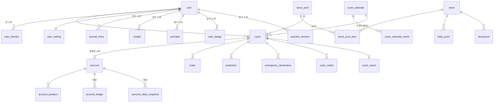
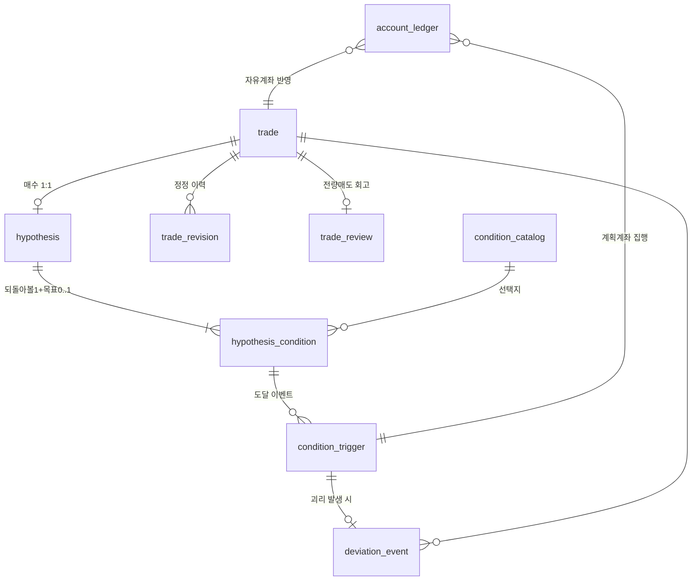
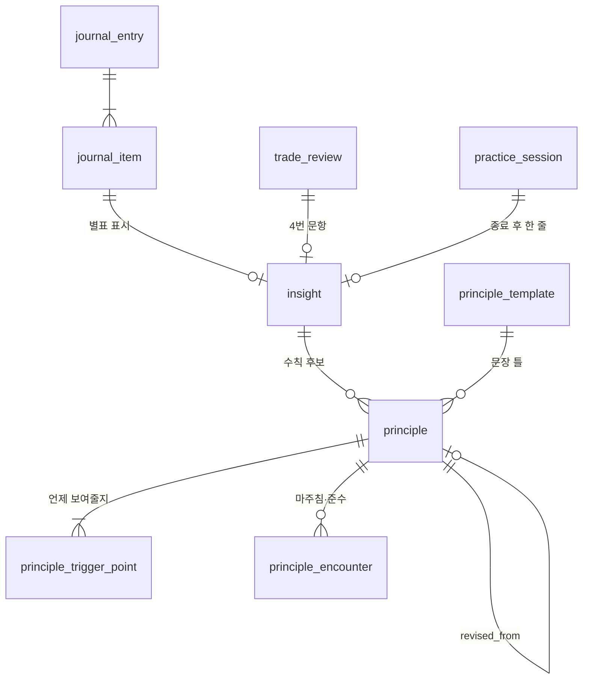

# 투자의 사계 — 데이터베이스 모델 설계서

| 항목 | 내용 |
| --- | --- |
| 문서 성격 | 상세 설계 문서 (구현 기준) |
| 상위 문서 | [PRD](./PRD.md) |
| 대상 | AWS RDS for PostgreSQL 16 / SQLModel (SQLAlchemy 2.x) |
| 범위 | MVP 전체 스키마, 제약, 인덱스, 파생 데이터 정책, 마이그레이션 |
| 관련 문서 | [API 명세](./API-SPEC.md), [백엔드 아키텍처](./BACKEND-ARCHITECTURE.md) |

---

## 목차

1. [설계 원칙](#1-설계-원칙)
2. [PRD 미결 사항의 설계 확정](#2-prd-미결-사항의-설계-확정)
3. [규약 — 명명·타입·공통 컬럼](#3-규약--명명타입공통-컬럼)
4. [스키마 그룹과 도메인 맵](#4-스키마-그룹과-도메인-맵)
5. [ERD](#5-erd)
6. [열거형 총람](#6-열거형-총람)
7. [테이블 정의 — A. 사용자와 인증](#7-테이블-정의--a-사용자와-인증)
8. [테이블 정의 — B. 시장 마스터 데이터](#8-테이블-정의--b-시장-마스터-데이터)
9. [테이블 정의 — C. 사이클과 계좌](#9-테이블-정의--c-사이클과-계좌)
10. [테이블 정의 — D. 매매와 가설 기록](#10-테이블-정의--d-매매와-가설-기록)
11. [테이블 정의 — E. 일지와 깨달은 것](#11-테이블-정의--e-일지와-깨달은-것)
12. [테이블 정의 — F. 투자 수칙](#12-테이블-정의--f-투자-수칙)
13. [테이블 정의 — G. 결산과 지표](#13-테이블-정의--g-결산과-지표)
14. [테이블 정의 — H. 연습 모드](#14-테이블-정의--h-연습-모드)
15. [테이블 정의 — I. 알림](#15-테이블-정의--i-알림)
16. [테이블 정의 — J. 시스템·운영](#16-테이블-정의--j-시스템운영)
17. [파생 데이터와 재계산 정책](#17-파생-데이터와-재계산-정책)
18. [불변식 목록](#18-불변식-목록)
19. [인덱스 전략](#19-인덱스-전략)
20. [보존·삭제·탈퇴 정책](#20-보존삭제탈퇴-정책)
21. [마이그레이션 전략](#21-마이그레이션-전략)
22. [확장 대비 설계](#22-확장-대비-설계)

---

## 1. 설계 원칙

| # | 원칙 | 적용 |
| --- | --- | --- |
| 1 | **입력과 파생을 분리한다** | 사용자가 입력한 사실(매매 기입, 가설, 일지)은 원본 테이블에 불변으로 남기고, 계좌 원장·스냅샷·집계 지표는 언제든 재계산 가능한 파생 테이블로 둔다. PRD 7.5·13.4의 정정 허용과 19.7의 "계산 방식이 바뀌면 과거를 재계산"을 동시에 만족시키는 유일한 구조다 |
| 2 | **네 계좌를 동일 구조로 표현한다** | 규칙·자유·내 계획대로·그냥 둔 계좌는 `account.account_type`만 다른 동일 스키마다. 계좌별로 테이블을 나누면 비교 쿼리가 계좌 수만큼 분기하고, 19.1의 복수 규칙 세트 확장이 불가능해진다 |
| 3 | **규칙은 코드가 아니라 데이터다** | 정기 조정 로직·수수료율·기준 건수·조건 선택지·배지 정의·수칙 문장 틀은 모두 테이블 또는 설정 레코드다 (PRD 19.1, 19.5) |
| 4 | **사이클을 넘는 것과 넘지 않는 것을 스키마로 구분한다** | 계좌·보유·거래는 `cycle_id`에 종속되고, 일지·깨달은 것·수칙·배지·연습 기록은 `user_id`에 직접 매달린다 (PRD 13.3). 소유 관계만 보고도 승계 여부를 판별할 수 있어야 한다 |
| 5 | **모든 기준일을 명시적으로 저장한다** | 성과·시세·판정은 항상 `as_of_date`를 함께 갖는다. PRD 7.9의 "○월 ○일 종가 기준" 표기는 화면 문구가 아니라 데이터 계약이다 |
| 6 | **삭제하지 않고 상태를 바꾼다** | 매매 정정, 조건 교체, 수칙 폐기는 물리 삭제가 아니라 상태 전이와 이력 레코드로 표현한다. 탈퇴만 물리 삭제 대상이다 |
| 7 | **측정값에는 항상 분모를 함께 저장한다** | PRD 5.4는 '규칙 실행 확인율'과 '내 계획 지킨 비율'을 절대 합치지 말 것을 요구한다. 비율 컬럼 단독 저장을 금지하고 분자·분모를 각각 저장한다 |
| 8 | **금액과 비율은 부동소수점을 쓰지 않는다** | 전부 `NUMERIC`. 4개 계좌 차이 계산에서 반올림 오차가 누적되면 제품의 핵심 산출물이 오염된다 |

---

## 2. PRD 미결 사항의 설계 확정

PRD 18장의 미결 사항 중 스키마에 영향을 주는 항목을 아래와 같이 확정한다. 모든 결정은 PRD의 권장안을 따랐으며, 번복 가능성이 있는 값은 **설정 테이블로 외부화**하여 스키마 변경 없이 바꿀 수 있게 했다.

| PRD | 항목 | 확정 내용 | 스키마 반영 |
| --- | --- | --- | --- |
| 18.1 | 시세 조달처 | 공급자 교체 가능한 수집 계층. 원천은 `data_source` 컬럼으로 기록 | `daily_price.source`, `ingestion_run` |
| 18.2 | 공시 | 발생 사실과 원문 링크만 저장, 본문 미저장 | `disclosure` (본문 컬럼 없음) |
| 18.3 | 조정일 달력 | 분기별 선물·옵션 만기일 다음 거래일. 4번째(12월)가 결산일 | `cycle_calendar`, `cycle_calendar_event` |
| 18.4 | 선정 공개 범위 | 배제 규칙만 정량 공개, 개별 종목 사유 미제공 | `stock_pool.exclusion_rules` (JSONB), 종목별 사유 컬럼 없음 |
| 18.5 | 시작 종목 수 | A안. 남은 조정 3/2/1/0회 → 10/8/6/4개 | `cycle.initial_symbol_count`, `cycle_plan_rule` |
| 18.6 | 조정 0회 사용자 | B안. `is_taster` 플래그, 결산 리포트 요약본 | `cycle.is_taster`, `cycle_report.report_mode` |
| 18.7 | 수칙 후보 생성 | 문장 틀 방식 | `principle_template` |
| 18.8 | 기준 건수 | 기본 3건, 항목별로 설정 가능 | `system_config` 키 `report.min_sample.*` |
| 18.9 | 수칙 준수 판정 | 사용자 탭 표시 기본, 자동 판정 유형 부가 | `principle_encounter.detection_mode`, `kept` |
| 18.10 | 규칙 조정 로직 | MVP 유지, 예시 규칙 명시 | `rule_strategy` 레코드 1건 |
| 18.11 | 측정 편향 | 자동/자기 보고 조건 비중을 지표로 저장·표시 | `cycle_metric` 키 `plan.self_report_ratio` |
| 18.12 | 로그인 | 카카오 단일. 공급자 추상화 | `user_identity.provider` |
| 18.13 | 실투자 전환 | 매매 출처 구분 필드만 선반영 | `trade.entry_source` |

---

## 3. 규약 — 명명·타입·공통 컬럼

### 3.1 명명 규약

| 대상 | 규약 | 예 |
| --- | --- | --- |
| 테이블 | 단수형 snake_case | `journal_entry` |
| 컬럼 | snake_case | `settlement_date` |
| 외래키 | `<참조테이블>_id` | `cycle_id` |
| 불리언 | `is_` / `has_` 접두 | `is_taster` |
| 시각 | `_at` 접미 (TIMESTAMPTZ) | `created_at` |
| 날짜 | `_date` 접미 (DATE) | `trade_date` |
| 금액 | `_amount` 접미 | `fee_amount` |
| 비율 | `_rate` 접미 (소수, 0.0312 = 3.12%) | `return_rate` |
| 개수 | `_count` 접미 | `encounter_count` |
| 인덱스 | `ix_<테이블>_<컬럼들>` | `ix_trade_cycle_id_trade_date` |
| 유니크 | `uq_<테이블>_<컬럼들>` | `uq_account_cycle_id_account_type` |
| 체크 | `ck_<테이블>_<의미>` | `ck_trade_quantity_positive` |
| 외래키 | `fk_<테이블>_<컬럼>` | `fk_trade_cycle_id` |

### 3.2 타입 규약

| 용도 | 타입 | 근거 |
| --- | --- | --- |
| 기본키 | `BIGINT GENERATED ALWAYS AS IDENTITY` | 시간 정렬 가능, 인덱스 크기 최소. 소유권 검증은 애플리케이션 인가 계층이 담당 |
| 외부 노출 식별자 | `UUID` (`user.public_id`만) | 공유 이미지·내보내기 파일명에 순번이 드러나지 않게 함 |
| 금액·포인트 | `NUMERIC(20, 4)` | 포인트는 원과 1:1. 수수료·세금 계산 후 소수점 유지 |
| 주가 | `NUMERIC(14, 2)` | 국내 주가 최대 자릿수 여유 |
| 수량 | `NUMERIC(18, 6)` | 3,000만 포인트 균등 배분 시 소수 수량이 필연적으로 발생한다. 정수로 내림하면 잔여 현금이 계좌마다 달라져 비교 기준이 무너진다 |
| 비율 | `NUMERIC(12, 8)` | 퍼센트포인트 차이를 소수 8자리까지 보존 |
| 열거값 | `VARCHAR(32)` + `CHECK` | PostgreSQL native ENUM은 값 추가 시 마이그레이션 잠금이 발생한다. 원칙 3(규칙은 데이터)과도 충돌 |
| 짧은 문자열 | `VARCHAR(n)` 명시 | 무제한 TEXT는 입력 검증 회피 통로가 된다 |
| 사용자 작성 본문 | `TEXT` + 애플리케이션 길이 제한 | 일지·수칙·회고 |
| 구조화 부가정보 | `JSONB` | 조건 파라미터, 리포트 페이로드, 배제 규칙 |
| 시각 | `TIMESTAMPTZ` | 저장은 UTC, 표시는 Asia/Seoul |
| 거래일 | `DATE` | 시간 성분 없음. 증시 개장일 기준 |

### 3.3 공통 컬럼

모든 테이블은 아래를 갖는다. 예외는 순수 참조 마스터(`trading_calendar` 등)로, `updated_at`을 생략할 수 있다.

| 컬럼 | 타입 | 기본값 | 설명 |
| --- | --- | --- | --- |
| `id` | BIGINT IDENTITY | — | 기본키 |
| `created_at` | TIMESTAMPTZ NOT NULL | `now()` | 생성 시각 |
| `updated_at` | TIMESTAMPTZ NOT NULL | `now()` | 수정 시각. 애플리케이션 계층에서 갱신 |

### 3.4 시간대 규약

| 항목 | 규칙 |
| --- | --- |
| 저장 | 전부 UTC |
| 도메인 기준 시간대 | `Asia/Seoul` 고정. 사용자별 시간대를 두지 않는다 (국내 주식 전용, PRD 1.4) |
| "오늘" 판정 | KST 기준 날짜. 폐장 후 기입 규칙(PRD 9.1)은 KST 15:30 이후로 판정 |
| 일별 배치 기준 | KST 18:00 (종가 확정 후) |

---

## 4. 스키마 그룹과 도메인 맵

물리적으로는 단일 PostgreSQL 스키마(`public`)를 쓰되, 테이블 접두 없이 **논리 그룹**으로 관리한다. 그룹은 백엔드의 모듈 경계와 1:1 대응한다.

| 그룹 | 테이블 | 소유 모듈 | 사이클 승계 |
| --- | --- | --- | --- |
| A. 사용자와 인증 | `user`, `user_identity`, `user_setting`, `user_survey_response`, `refresh_token` | `accounts` | 해당 없음 |
| B. 시장 마스터 | `stock`, `stock_pool`, `stock_pool_item`, `daily_price`, `corporate_action`, `disclosure`, `earnings_schedule`, `market_index_daily`, `market_investor_flow`, `trading_calendar`, `cycle_calendar`, `cycle_calendar_event` | `market` | 전 사용자 공통 |
| C. 사이클과 계좌 | `cycle`, `cycle_plan_rule`, `rule_strategy`, `cycle_stock_selection`, `account`, `account_position`, `account_ledger`, `account_daily_snapshot`, `rebalance_execution`, `rebalance_confirmation`, `settlement_followup` | `portfolio` | 계좌는 초기화, 선택 이유는 기록으로 승계 |
| D. 매매와 가설 | `trade`, `trade_revision`, `hypothesis`, `hypothesis_condition`, `condition_catalog`, `condition_trigger`, `trade_review`, `deviation_event` | `trading` | 기록은 승계 |
| E. 일지 | `journal_entry`, `journal_item`, `insight`, `insight_tag_catalog`, `journal_streak` | `journal` | 승계 |
| F. 수칙 | `principle`, `principle_trigger_point`, `principle_encounter`, `principle_template` | `principle` | 승계 |
| G. 결산·지표 | `cycle_metric`, `cycle_report`, `prediction`, `emergency_declaration`, `cycle_retrospective`, `badge_definition`, `user_badge` | `settlement` | 승계 |
| H. 연습 모드 | `practice_scenario`, `practice_scenario_day`, `practice_session`, `practice_session_decision` | `practice` | 승계 |
| I. 알림 | `notification`, `notification_device`, `notification_preference` | `notification` | 해당 없음 |
| J. 시스템 | `system_config`, `ingestion_run`, `recompute_job`, `export_job`, `audit_log`, `onboarding_progress`, `idempotency_record` | `system` | 해당 없음 |

---

## 5. ERD

### 5.1 핵심 흐름 (사용자 → 사이클 → 계좌 → 성과)



### 5.2 가설 기록과 판정 흐름



### 5.3 레슨 축적 흐름



---

## 6. 열거형 총람

모든 열거형은 `VARCHAR` + `CHECK` 제약으로 구현하고, Python에서는 `str` 상속 Enum으로 정의한다. 값은 대문자 SNAKE_CASE.

| 열거형 | 사용처 | 값 | 비고 |
| --- | --- | --- | --- |
| `UserStatus` | `user.status` | `ACTIVE`, `DORMANT`, `WITHDRAWN` | `DORMANT`는 3개월 미접속 (PRD 13.2), 알림 감축 대상 |
| `AuthProvider` | `user_identity.provider` | `KAKAO` | 18.12. 확장 지점 |
| `InvestorType` | `user_survey_response.result_type` | `AGGRESSIVE`, `DEFENSIVE` | PRD 14.1 |
| `MarketCode` | `stock.market` | `KOSPI`, `KOSDAQ` | |
| `StockStatus` | `stock.status` | `LISTED`, `SUSPENDED_SHORT`, `SUSPENDED_LONG`, `DELISTED` | PRD 7.8 |
| `CorporateActionType` | `corporate_action.action_type` | `MERGER`, `SPLIT`, `FACE_VALUE_SPLIT`, `SUSPENSION_START`, `SUSPENSION_END`, `DELISTING` | PRD 7.8 |
| `CycleStatus` | `cycle.status` | `PREPARING`, `ACTIVE`, `SETTLING`, `CLOSED`, `ABANDONED` | `PREPARING`은 종목 선택은 끝났으나 첫 가설 기록 미완 (PRD 14.3) |
| `AccountType` | `account.account_type` | `RULE`, `FREE`, `PLAN`, `HOLD` | 순서대로 규칙 투자 / 자유 투자 / 내 계획대로 / 그냥 둔 |
| `TradeSide` | `trade.side`, `account_ledger.side` | `BUY`, `SELL` | |
| `TradeStatus` | `trade.status` | `ACTIVE`, `SUPERSEDED`, `DELETED` | 정정 시 원본은 `SUPERSEDED` |
| `TradeEntrySource` | `trade.entry_source` | `USER_MANUAL`, `SYSTEM_INITIAL`, `SYSTEM_SETTLEMENT`, `EXTERNAL_SYNC` | `EXTERNAL_SYNC`는 19.3 대비 예약값 |
| `LedgerSource` | `account_ledger.source` | `INITIAL_ALLOCATION`, `USER_TRADE`, `RULE_REBALANCE`, `PLAN_EXECUTION`, `SETTLEMENT_LIQUIDATION`, `CORPORATE_ACTION` | 원장 한 줄이 어떤 엔진에서 나왔는지 |
| `ConditionKind` | `hypothesis_condition.kind` | `REVIEW`, `TARGET` | 되돌아볼 조건 / 목표 |
| `ConditionEvaluationMode` | `hypothesis_condition.evaluation_mode` | `AUTO`, `SELF_REPORT` | 18.11 편향 측정의 근거 |
| `PlannedAction` | `hypothesis_condition.planned_action` | `SELL_ALL`, `SELL_HALF`, `HOLD` | PRD 9.4. 기본값 없음 |
| `ConditionStatus` | `hypothesis_condition.status` | `ACTIVE`, `TRIGGERED`, `SUPERSEDED`, `CLOSED` | 종목당 `ACTIVE`는 kind별 최대 1건 (PRD 7.6) |
| `TriggerResponse` | `condition_trigger.user_response` | `FOLLOWED`, `DEVIATED`, `REPLANNED`, `NO_RESPONSE` | PRD 9.8의 3가지 + 무응답 |
| `DeviationCategory` | `deviation_event.category` | `SAID_SELL_BUT_HELD`, `SAID_HOLD_BUT_SOLD`, `SOLD_BEFORE_CONDITION`, `UNPLANNED_ADD_BUY`, `NO_HYPOTHESIS_BUY`, `FOLLOWED_AS_PLANNED`, `OTHER` | PRD 7.9의 5개 + 긍정 집계 1개 + 잔차 귀속용 1개. 대칭 짝 정의는 §13.7 |
| `JournalType` | `journal_entry.entry_type` | `DAILY`, `WEEKLY`, `MONTHLY` | |
| `InsightSourceType` | `insight.source_type` | `JOURNAL_ITEM`, `TRADE_REVIEW`, `PRACTICE_SESSION`, `MANUAL` | |
| `InsightTag` | `insight.tag` | `BUY_TIMING`, `SELL_TIMING`, `STOCK_PICKING`, `INFO_JUDGEMENT`, `MY_PSYCHOLOGY`, `MARKET_FLOW`, `UNCLASSIFIED` | PRD 10.3의 6개 + 분류 안 함 |
| `PrincipleStatus` | `principle.status` | `DRAFT`, `ACTIVE`, `REVISED`, `RETIRED` | `DRAFT`는 온보딩 임시 수칙 |
| `PrincipleTriggerPoint` | `principle_trigger_point.trigger_point` | `ON_BUY`, `ON_SELL`, `ON_CONDITION_HIT`, `ON_MONTHLY_JOURNAL`, `ON_CYCLE_START` | PRD 11.5 |
| `PrincipleVerdict` | `principle.next_cycle_verdict` | `KEEP`, `REVISE`, `RETIRE`, `DEFERRED` | `DEFERRED`는 마주침 3회 미만 |
| `EncounterDetectionMode` | `principle_encounter.detection_mode` | `USER_TAP`, `AUTO` | 18.9 |
| `PredictionType` | `prediction.prediction_type` | `CYCLE_WINNER`, `QUARTER_ADHERENCE` | PRD 9.9 |
| `ReportMode` | `cycle_report.report_mode` | `FULL`, `SUMMARY`, `NO_DATA` | PRD 13.2 |
| `BadgeCategory` | `badge_definition.category` | `DEVIATION`, `ADHERENCE`, `HABIT`, `PRACTICE` | 양방향 대칭 검증 단위 |
| `NotificationType` | `notification.notification_type` | `CONDITION_HIT`, `REBALANCE_DAY`, `SETTLEMENT_DAY`, `NEXT_CYCLE_OPEN`, `WEEKLY_REVIEW`, `MONTHLY_REVIEW`, `DAILY_JOURNAL` | PRD 10.6. 우선순위 매핑은 §15.1 |
| `NotificationChannel` | `notification.channel` | `PUSH`, `IN_APP` | |
| `NotificationStatus` | `notification.status` | `PENDING`, `SENT`, `SUPPRESSED`, `FAILED` | `SUPPRESSED`는 하루 1건 제한에 밀린 것 |
| `JobStatus` | `recompute_job.status`, `export_job.status`, `ingestion_run.status` | `QUEUED`, `RUNNING`, `SUCCEEDED`, `FAILED` | |
| `ExportTarget` | `export_job.target` | `CYCLE_REPORT`, `TRADES`, `JOURNALS`, `PRINCIPLES`, `ALL` | PRD 13.5 |

---

## 7. 테이블 정의 — A. 사용자와 인증

### 7.1 `user`

계정의 최소 단위. 카카오 프로필은 필요한 것만 캐시하고 원본을 저장하지 않는다.

| 컬럼 | 타입 | NULL | 기본값 | 설명 |
| --- | --- | --- | --- | --- |
| `id` | BIGINT IDENTITY | N | — | PK |
| `public_id` | UUID | N | `gen_random_uuid()` | 외부 노출용. 공유 이미지·내보내기 파일명 |
| `nickname` | VARCHAR(20) | N | — | 표시명. 카카오 닉네임 초기 복사 후 사용자 수정 가능 |
| `email` | VARCHAR(255) | Y | — | 카카오 동의 시에만. 알림·복구 안내용 |
| `status` | VARCHAR(32) | N | `'ACTIVE'` | `UserStatus` |
| `investor_type` | VARCHAR(32) | Y | — | `InvestorType`. 최신 설문 결과 캐시 (종목 풀 정렬용) |
| `onboarded_at` | TIMESTAMPTZ | Y | — | 온보딩 8단계 완료 시각 |
| `last_active_at` | TIMESTAMPTZ | Y | — | 휴면 판정 기준 (PRD 13.2) |
| `withdrawn_at` | TIMESTAMPTZ | Y | — | 탈퇴 요청 시각. 유예 기간 관리 |

**제약**
- `uq_user_public_id` UNIQUE(`public_id`)
- `ck_user_status` CHECK(`status` IN (...))

**인덱스**
- `ix_user_last_active_at` — 휴면 배치
- `ix_user_status_withdrawn_at` — 탈퇴 유예 만료 배치

### 7.2 `user_identity`

소셜 로그인 자격 증명. `user`와 분리하여 18.12의 백업 수단(이메일 등) 추가 시 스키마 변경이 없도록 한다.

| 컬럼 | 타입 | NULL | 설명 |
| --- | --- | --- | --- |
| `id` | BIGINT IDENTITY | N | PK |
| `user_id` | BIGINT | N | FK → `user.id` ON DELETE CASCADE |
| `provider` | VARCHAR(32) | N | `AuthProvider` |
| `provider_user_id` | VARCHAR(128) | N | 카카오 회원번호 |
| `linked_at` | TIMESTAMPTZ | N | 연결 시각 |

**제약**: `uq_user_identity_provider` UNIQUE(`provider`, `provider_user_id`)

### 7.3 `user_setting`

사용자당 1행. 기본값은 모두 "켜짐"이되 배지는 사용자가 끌 수 있어야 한다 (PRD 7.10).

| 컬럼 | 타입 | 기본값 | 설명 |
| --- | --- | --- | --- |
| `user_id` | BIGINT | — | PK 겸 FK → `user.id` |
| `is_badge_enabled` | BOOLEAN | `true` | 배지 기능 자체를 끄기 |
| `is_badge_public_hidden` | BOOLEAN | `false` | 배지를 숨기기 (기능은 유지) |
| `daily_journal_reminder_hour` | SMALLINT | `20` | KST 기준 시. 폐장 후 (PRD 10.7) |
| `weekly_review_weekday` | SMALLINT | `6` | 0=월 … 6=일. 주말 오전 고정 |
| `is_marketing_agreed` | BOOLEAN | `false` | |
| `timezone` | VARCHAR(64) | `'Asia/Seoul'` | 향후 확장용. MVP는 고정 |
| `theme_preference` | VARCHAR(32) | `'SYSTEM'` | `SYSTEM`/`LIGHT`/`DARK` |
| `profit_color_scheme` | VARCHAR(32) | `'KR'` | `KR`(상승 적/하락 청) / `INTL`(반전). 디자인 시스템 §3.4 |

> 표시 설정을 서버에 두는 이유는 기기 간 동기화 때문이다. 로컬 스토리지에만 두면 PWA 재설치나 다른 기기 접속 시 손익 색이 뒤집혀 보이고, 색 반전은 수치 오독으로 직결된다.

### 7.4 `user_survey_response`

투자 성향 설문 (PRD 14.4). 결산 대조에 쓰이므로 **응답 원본을 보존**한다. 사이클마다 다시 받을 수 있어 `cycle_id`를 선택적으로 갖는다.

| 컬럼 | 타입 | NULL | 설명 |
| --- | --- | --- | --- |
| `id` | BIGINT IDENTITY | N | PK |
| `user_id` | BIGINT | N | FK → `user.id` |
| `cycle_id` | BIGINT | Y | FK → `cycle.id`. 온보딩 시점에는 NULL |
| `answers` | JSONB | N | `[{question_key, choice_key}]` |
| `result_type` | VARCHAR(32) | N | `InvestorType` |
| `answered_at` | TIMESTAMPTZ | N | |

### 7.5 `refresh_token`

| 컬럼 | 타입 | 설명 |
| --- | --- | --- |
| `id` | BIGINT IDENTITY | PK |
| `user_id` | BIGINT | FK → `user.id` ON DELETE CASCADE |
| `token_hash` | CHAR(64) | SHA-256 해시. 평문 저장 금지 |
| `expires_at` | TIMESTAMPTZ | |
| `revoked_at` | TIMESTAMPTZ | 로그아웃·탈퇴 시 |
| `device_label` | VARCHAR(64) | 감사용 |

**인덱스**: `uq_refresh_token_hash` UNIQUE(`token_hash`), `ix_refresh_token_user_id_expires_at`

---

## 8. 테이블 정의 — B. 시장 마스터 데이터

### 8.1 `stock`

종목 마스터. 종목 풀에서 빠져도 과거 기록 조회를 위해 영구 보존한다 (PRD 10.4의 "지난 사이클 기록 포함").

| 컬럼 | 타입 | NULL | 설명 |
| --- | --- | --- | --- |
| `id` | BIGINT IDENTITY | N | PK |
| `ticker` | CHAR(6) | N | 종목코드 |
| `name` | VARCHAR(60) | N | 종목명 |
| `market` | VARCHAR(32) | N | `MarketCode` |
| `sector_code` | VARCHAR(16) | Y | 업종 분산 검증용 (PRD 15.1) |
| `sector_name` | VARCHAR(60) | Y | |
| `status` | VARCHAR(32) | N | `StockStatus` |
| `status_changed_at` | TIMESTAMPTZ | Y | 거래정지·상폐 판정 시각 |
| `listed_at` | DATE | Y | 상장 경과 기간 배제 규칙 검증용 |

**제약**: `uq_stock_ticker` UNIQUE(`ticker`)

### 8.2 `stock_pool`

연도별 종목 풀. **연 1회, 전 사용자 공통** (PRD 15.1).

| 컬럼 | 타입 | NULL | 설명 |
| --- | --- | --- | --- |
| `id` | BIGINT IDENTITY | N | PK |
| `year` | SMALLINT | N | 대상 연도 |
| `published_at` | TIMESTAMPTZ | Y | 공개 시각. NULL이면 준비 중 |
| `exclusion_rules` | JSONB | N | 배제 규칙 정량 명시 (18.4). `[{rule_key, label, threshold}]` |
| `note` | TEXT | Y | 운영자 메모. **사용자 비노출** |

**제약**: `uq_stock_pool_year` UNIQUE(`year`)

> 개별 종목의 **선정 사유 컬럼을 두지 않는다.** 컬럼이 존재하면 언젠가 노출되고, 그 순간 PRD 17.1의 마지막 금지 문구를 위반한다. 스키마 수준에서 차단한다.

### 8.3 `stock_pool_item`

| 컬럼 | 타입 | NULL | 설명 |
| --- | --- | --- | --- |
| `id` | BIGINT IDENTITY | N | PK |
| `stock_pool_id` | BIGINT | N | FK → `stock_pool.id` |
| `stock_id` | BIGINT | N | FK → `stock.id` |
| `display_order` | SMALLINT | N | 기본 정렬 순서 |
| `defensive_rank` | SMALLINT | Y | 방어형 정렬 순위 (PRD 14.4) |
| `aggressive_rank` | SMALLINT | Y | 적극형 정렬 순위 |

**제약**
- `uq_stock_pool_item` UNIQUE(`stock_pool_id`, `stock_id`)
- 애플리케이션 불변식: 풀당 정확히 30건 (`published_at` 설정 시 검증)

### 8.4 `daily_price`

일별 시세. 수집 범위는 **해당 연도 종목 풀 30개 + 연습 모드 데이터**로 한정한다 (PRD 3.3).

| 컬럼 | 타입 | NULL | 설명 |
| --- | --- | --- | --- |
| `id` | BIGINT IDENTITY | N | PK |
| `stock_id` | BIGINT | N | FK → `stock.id` |
| `trade_date` | DATE | N | 거래일 |
| `open_price` | NUMERIC(14,2) | N | 시가 |
| `high_price` | NUMERIC(14,2) | N | 고가 |
| `low_price` | NUMERIC(14,2) | N | 저가 |
| `close_price` | NUMERIC(14,2) | N | 종가. **모든 판정과 평가의 기준** |
| `volume` | BIGINT | N | 거래량 |
| `trading_value` | NUMERIC(20,0) | Y | 거래대금 |
| `adjust_factor` | NUMERIC(18,10) | N | 수정주가 계수. 기본 1.0 |
| `source` | VARCHAR(32) | N | 데이터 원천 (18.1) |
| `is_anomaly` | BOOLEAN | N | 수집 시 이상치 판정(전일 대비 ±40% 초과 등). 저장은 하되 경보 대상 |

**제약**: `uq_daily_price_stock_date` UNIQUE(`stock_id`, `trade_date`)

**인덱스**: `ix_daily_price_trade_date` (일별 배치 스캔용)

> **고가·저가를 저장하되 판정에 쓰지 않는다.** PRD 7.11-3은 조건 도달을 종가 기준으로만 판정할 것을 요구한다. 고가·저가는 종목 상세 차트 표시 전용이며, 판정 엔진은 `close_price`만 참조한다. 이 규칙은 백엔드 도메인 계층에서 강제한다.

### 8.5 `corporate_action`

거래정지·상장폐지·합병·분할 (PRD 7.8). **네 계좌 전부에 영향**을 주므로 별도 이벤트 테이블로 두고 계좌 리플레이 입력으로 사용한다.

| 컬럼 | 타입 | NULL | 설명 |
| --- | --- | --- | --- |
| `id` | BIGINT IDENTITY | N | PK |
| `stock_id` | BIGINT | N | FK → `stock.id` |
| `action_type` | VARCHAR(32) | N | `CorporateActionType` |
| `effective_date` | DATE | N | 효력 발생일 |
| `freeze_price` | NUMERIC(14,2) | Y | 정지 직전 종가. 평가 고정값 |
| `ratio_numerator` | NUMERIC(18,6) | Y | 합병·분할 비율 |
| `ratio_denominator` | NUMERIC(18,6) | Y | |
| `is_liquidation_required` | BOOLEAN | N | 네 계좌 일괄 정리 여부 |
| `notice_text` | VARCHAR(200) | Y | 사용자 안내 문구 |

**제약**: `uq_corporate_action` UNIQUE(`stock_id`, `action_type`, `effective_date`)

### 8.6 `disclosure`

공시 **발생 사실과 원문 링크만** 저장한다 (PRD 15.2). 본문 컬럼을 두지 않는 것이 설계 의도다.

| 컬럼 | 타입 | NULL | 설명 |
| --- | --- | --- | --- |
| `id` | BIGINT IDENTITY | N | PK |
| `stock_id` | BIGINT | N | FK → `stock.id` |
| `receipt_no` | VARCHAR(32) | N | 공시 접수번호 |
| `title` | VARCHAR(300) | N | 공시 제목 (원문 그대로, 가공 금지) |
| `disclosed_at` | TIMESTAMPTZ | N | 접수 시각 |
| `source_url` | VARCHAR(500) | N | 원문 링크 |
| `submitter` | VARCHAR(100) | Y | 제출인 |

**제약**: `uq_disclosure_receipt_no` UNIQUE(`receipt_no`)

**인덱스**: `ix_disclosure_stock_id_disclosed_at` DESC

### 8.7 `market_index_daily`

| 컬럼 | 타입 | 설명 |
| --- | --- | --- |
| `id` | BIGINT IDENTITY | PK |
| `index_code` | VARCHAR(16) | `KOSPI`, `KOSDAQ` |
| `trade_date` | DATE | |
| `close_value` | NUMERIC(14,2) | |
| `change_rate` | NUMERIC(12,8) | 전일 대비 |
| `trading_value` | NUMERIC(20,0) | 거래대금 |

**제약**: `uq_market_index_daily` UNIQUE(`index_code`, `trade_date`)

### 8.8 `market_investor_flow`

투자 주체별 수급 (PRD 10.1 월간 일지 수치).

| 컬럼 | 타입 | 설명 |
| --- | --- | --- |
| `id` | BIGINT IDENTITY | PK |
| `market` | VARCHAR(32) | `MarketCode` |
| `trade_date` | DATE | |
| `investor_type` | VARCHAR(32) | `FOREIGN`, `INSTITUTION`, `INDIVIDUAL` |
| `net_buy_amount` | NUMERIC(20,0) | 순매수 금액 |

**제약**: `uq_market_investor_flow` UNIQUE(`market`, `trade_date`, `investor_type`)

### 8.9 `earnings_schedule`

실적 발표 일정. PRD 15.2가 서비스가 제공하는 '사실' 3종 중 하나로 명시한다. **일정(날짜)만 저장하고 실적 수치나 전망은 저장하지 않는다** — 수치를 담는 순간 해석 제공에 가까워지고, 컨센서스는 유료 데이터다 (PRD 15.3-3).

| 컬럼 | 타입 | NULL | 설명 |
| --- | --- | --- | --- |
| `id` | BIGINT IDENTITY | N | PK |
| `stock_id` | BIGINT | N | FK → `stock.id` |
| `fiscal_period` | VARCHAR(16) | N | `2026Q2` 형태 |
| `scheduled_date` | DATE | N | 발표 예정일 |
| `is_confirmed` | BOOLEAN | N | 확정 여부. 잠정 일정과 구분 |
| `source_url` | VARCHAR(500) | Y | 원문 링크 |
| `source` | VARCHAR(32) | N | 데이터 원천 |

**제약**: `uq_earnings_schedule` UNIQUE(`stock_id`, `fiscal_period`)

**인덱스**: `ix_earnings_schedule_date` (`scheduled_date`) — 종목 상세와 홈의 다가오는 일정 조회

### 8.10 `trading_calendar`

증시 개장일. 기입 가능일·판정일·조정일 산출의 기준.

| 컬럼 | 타입 | 설명 |
| --- | --- | --- |
| `calendar_date` | DATE | PK |
| `is_open` | BOOLEAN | 개장 여부 |
| `is_half_day` | BOOLEAN | 단축 거래일 |
| `note` | VARCHAR(60) | 휴장 사유 |

> 최소 향후 2년치를 사전 적재한다. 조정일 산출(18.3)은 이 테이블 없이는 불가능하다.

### 8.11 `cycle_calendar`

연도별 사이클 달력. **전 사용자 공통** (PRD 8.3).

| 컬럼 | 타입 | NULL | 설명 |
| --- | --- | --- | --- |
| `id` | BIGINT IDENTITY | N | PK |
| `year` | SMALLINT | N | |
| `rule_key` | VARCHAR(64) | N | 산출 규칙 식별자. 기본 `QUARTERLY_EXPIRY_NEXT_TRADING_DAY` |
| `settlement_date` | DATE | N | 결산일 (= 4번째 이벤트) |
| `confirmed_at` | TIMESTAMPTZ | Y | 운영자 확인 시각 (PRD 3.4의 연 1회 30분 작업) |

**제약**: `uq_cycle_calendar_year` UNIQUE(`year`)

### 8.12 `cycle_calendar_event`

| 컬럼 | 타입 | 설명 |
| --- | --- | --- |
| `id` | BIGINT IDENTITY | PK |
| `cycle_calendar_id` | BIGINT | FK → `cycle_calendar.id` |
| `sequence` | SMALLINT | 1~4 |
| `event_date` | DATE | 조정일 또는 결산일 |
| `is_settlement` | BOOLEAN | `sequence=4`일 때 true |

**제약**: `uq_cycle_calendar_event` UNIQUE(`cycle_calendar_id`, `sequence`)

---

## 9. 테이블 정의 — C. 사이클과 계좌

### 9.1 `cycle`

사용자별 사이클. **사용자당 연 1개** (PRD 5.2).

| 컬럼 | 타입 | NULL | 설명 |
| --- | --- | --- | --- |
| `id` | BIGINT IDENTITY | N | PK |
| `user_id` | BIGINT | N | FK → `user.id` |
| `year` | SMALLINT | N | 달력 연도 |
| `stock_pool_id` | BIGINT | N | FK → `stock_pool.id` |
| `cycle_calendar_id` | BIGINT | N | FK → `cycle_calendar.id` |
| `status` | VARCHAR(32) | N | `CycleStatus` |
| `started_on` | DATE | Y | 첫 가설 기록 완료일. `ACTIVE` 전이 시점 |
| `settlement_date` | DATE | N | 달력에서 복사. 조회 편의 |
| `remaining_rebalance_count` | SMALLINT | N | 시작 시점 기준 남은 정기 조정 횟수 (3/2/1/0) |
| `initial_symbol_count` | SMALLINT | N | 시작 종목 수 (10/8/6/4). 18.5-A안 |
| `initial_capital_per_track` | NUMERIC(20,4) | N | 트랙당 초기 자금. 기본 30,000,000 |
| `is_taster` | BOOLEAN | N | 조정 0회 사이클 (18.6-B안) |
| `length_months` | NUMERIC(5,2) | Y | 결산 시 확정. 리포트 표기용 (PRD 7.9) |
| `restart_count` | SMALLINT | N | 재시작 횟수. 최대 1 (PRD 13.4) |
| `closed_at` | TIMESTAMPTZ | Y | 결산 완료 시각 |

**제약**
- `uq_cycle_user_year` UNIQUE(`user_id`, `year`)
- `ck_cycle_restart_count` CHECK(`restart_count` <= 1)
- `ck_cycle_symbol_count` CHECK(`initial_symbol_count` IN (4,6,8,10))

**인덱스**: `ix_cycle_status_settlement_date` (결산 배치)

> `remaining_rebalance_count`와 `initial_symbol_count`를 **시작 시점에 확정해 저장**한다. 계산으로 유도하면 사용자가 온보딩 중 이탈했다가 조정일이 지난 뒤 복귀했을 때 값이 달라진다 (PRD 14.3). 재진입 시 갱신은 `PREPARING` 상태에서만 허용한다.

### 9.2 `cycle_plan_rule`

18.5-A안의 축소 경로 매핑. 코드 상수가 아닌 데이터로 관리한다 (원칙 3).

| 컬럼 | 타입 | 설명 |
| --- | --- | --- |
| `id` | BIGINT IDENTITY | PK |
| `remaining_rebalance_count` | SMALLINT | 0~3 |
| `initial_symbol_count` | SMALLINT | 10/8/6/4 |
| `reduction_path` | JSONB | `[10,8,6,4]` 형태 |
| `effective_year` | SMALLINT | 적용 연도. 규칙 변경 시 연도별로 분기 |

**제약**: `uq_cycle_plan_rule` UNIQUE(`effective_year`, `remaining_rebalance_count`)

### 9.3 `rule_strategy`

규칙 투자 전략 정의 (PRD 19.1 대비). MVP에서는 1행만 존재한다.

| 컬럼 | 타입 | 설명 |
| --- | --- | --- |
| `id` | BIGINT IDENTITY | PK |
| `strategy_key` | VARCHAR(64) | `WORST_TWO_REDISTRIBUTE` |
| `name` | VARCHAR(60) | 사용자 노출명 |
| `parameters` | JSONB | `{sell_count: 2, ranking_metric: "PERIOD_RETURN", tie_breakers: ["CUMULATIVE_RETURN","TICKER"], redistribute: "EQUAL_WEIGHT"}` |
| `disclaimer_text` | TEXT | 예시 규칙 안내 문구 (PRD 8.4) |
| `is_active` | BOOLEAN | |

### 9.4 `cycle_stock_selection`

사이클 시작 시 고른 종목과 **선택 이유** (PRD 16-B4의 "자기 선택의 근거가 기록됨"). 최초 매수는 `account_ledger`에 들어가지만, "왜 이 종목을 골랐는가"는 계좌 기록이 아니라 판단 기록이므로 별도 테이블에 남긴다.

| 컬럼 | 타입 | NULL | 설명 |
| --- | --- | --- | --- |
| `id` | BIGINT IDENTITY | N | PK |
| `cycle_id` | BIGINT | N | FK → `cycle.id` |
| `stock_id` | BIGINT | N | FK → `stock.id` |
| `display_order` | SMALLINT | N | 선택 순서 |
| `reason_text` | VARCHAR(200) | Y | 선택 이유. **선택 입력** (PRD 4.3의 입력 마찰 최소화) |
| `selected_at` | TIMESTAMPTZ | N | |
| `restart_generation` | SMALLINT | N | 재시작 세대. 0이 최초, 1이 재시작 후 |

**제약**: `uq_cycle_stock_selection` UNIQUE(`cycle_id`, `stock_id`, `restart_generation`)

> `restart_generation`을 두어 **재시작 전 선택도 남긴다.** PRD 13.4는 계좌를 버리라고 했지 기록을 지우라고 하지 않았으며, "무엇을 골랐다가 무엇으로 바꿨는가"는 결산에서 유용한 회고 재료다. 다만 계좌 계산에는 최신 세대만 사용한다.

### 9.5 `account`

**사이클당 정확히 4행.** 네 계좌의 유일한 차이는 원장을 생성하는 주체다.

| 컬럼 | 타입 | NULL | 설명 |
| --- | --- | --- | --- |
| `id` | BIGINT IDENTITY | N | PK |
| `cycle_id` | BIGINT | N | FK → `cycle.id` |
| `account_type` | VARCHAR(32) | N | `AccountType` |
| `rule_strategy_id` | BIGINT | Y | `RULE` 계좌만 사용 |
| `initial_capital` | NUMERIC(20,4) | N | 전 계좌 30,000,000 (PRD 7.3) |
| `cash_balance` | NUMERIC(20,4) | N | 현재 현금. 파생값 캐시 |
| `market_value` | NUMERIC(20,4) | N | 보유 평가액. 파생값 캐시 |
| `total_value` | NUMERIC(20,4) | N | 현금+평가액. 파생값 캐시 |
| `return_rate` | NUMERIC(12,8) | N | 초기자본 대비. 파생값 캐시 |
| `valued_on` | DATE | Y | 캐시 기준일. **화면에 항상 표기** |

**제약**
- `uq_account_cycle_type` UNIQUE(`cycle_id`, `account_type`)
- `ck_account_rule_strategy` CHECK(`account_type` = 'RULE' OR `rule_strategy_id` IS NULL)

> **`HOLD` 계좌도 초기 자본 3,000만이다.** 두 실제 계좌 각각과 비교되어야 하므로 6,000만이 아니다 (PRD 7.3). 이 값을 잘못 넣으면 세 개의 차이가 전부 틀어진다.

### 9.6 `account_position`

계좌별 현재 보유. 파생 테이블이며 원장 리플레이로 재생성된다.

| 컬럼 | 타입 | 설명 |
| --- | --- | --- |
| `id` | BIGINT IDENTITY | PK |
| `account_id` | BIGINT | FK → `account.id` |
| `stock_id` | BIGINT | FK → `stock.id` |
| `quantity` | NUMERIC(18,6) | 보유 수량 |
| `average_cost` | NUMERIC(14,2) | 평균 매입가 (비용 포함) |
| `total_cost_amount` | NUMERIC(20,4) | 총 매입 원가 |
| `market_value` | NUMERIC(20,4) | 평가액 |
| `unrealized_pnl` | NUMERIC(20,4) | 평가손익 |
| `is_valuation_frozen` | BOOLEAN | 거래정지로 평가 고정 (PRD 7.8) |
| `valued_on` | DATE | 평가 기준일 |

**제약**
- `uq_account_position` UNIQUE(`account_id`, `stock_id`)
- `ck_account_position_quantity` CHECK(`quantity` >= 0)

> 수량 0인 행은 삭제하지 않고 남긴다. "판 종목 다시 매수"(PRD 9.2)와 평균단가 이력 추적에 필요하다.

### 9.7 `account_ledger`

**네 계좌 전부의 거래 원장.** 이 테이블이 계좌 계산의 단일 진실 원천이다.

| 컬럼 | 타입 | NULL | 설명 |
| --- | --- | --- | --- |
| `id` | BIGINT IDENTITY | N | PK |
| `account_id` | BIGINT | N | FK → `account.id` |
| `stock_id` | BIGINT | N | FK → `stock.id` |
| `trade_date` | DATE | N | 체결 기준일 (항상 종가일) |
| `side` | VARCHAR(32) | N | `TradeSide` |
| `quantity` | NUMERIC(18,6) | N | |
| `base_price` | NUMERIC(14,2) | N | 종가 |
| `executed_price` | NUMERIC(14,2) | N | 체결 오차 반영 후 단가 |
| `gross_amount` | NUMERIC(20,4) | N | `executed_price` × `quantity` |
| `fee_amount` | NUMERIC(20,4) | N | 수수료 |
| `tax_amount` | NUMERIC(20,4) | N | 거래세 (매도만) |
| `net_amount` | NUMERIC(20,4) | N | 현금 증감액 (부호 포함) |
| `realized_pnl` | NUMERIC(20,4) | Y | 매도 시 실현손익 |
| `source` | VARCHAR(32) | N | `LedgerSource` |
| `trade_id` | BIGINT | Y | FK → `trade.id`. `USER_TRADE`일 때 |
| `condition_trigger_id` | BIGINT | Y | FK → `condition_trigger.id`. `PLAN_EXECUTION`일 때 |
| `rebalance_execution_id` | BIGINT | Y | FK → `rebalance_execution.id`. `RULE_REBALANCE`일 때 |
| `corporate_action_id` | BIGINT | Y | FK → `corporate_action.id` |
| `sequence_in_day` | SMALLINT | N | 같은 날 복수 집행의 순서. 우선순위 규칙(PRD 7.5) 결과 |

**제약**
- `ck_account_ledger_quantity_positive` CHECK(`quantity` > 0)
- `ck_account_ledger_source_ref` — `source`별로 대응 FK가 정확히 하나만 NOT NULL

**인덱스**
- `ix_account_ledger_account_date` (`account_id`, `trade_date`, `sequence_in_day`) — 리플레이 순회
- `ix_account_ledger_trade_id` — 정정 시 영향 범위 탐색

> **체결 오차(`executed_price` ≠ `base_price`)는 가상 계좌(`PLAN`, `HOLD`, `RULE`)의 조건 집행·조정에만 적용한다** (PRD 7.7). 사용자 기입 매매는 사용자가 적은 가격을 그대로 쓴다. 수수료·세금은 네 계좌 전부에 동일하게 적용한다. 이 순서를 바꾸면 자유 투자가 구조적으로 유리해진다.

### 9.8 `account_daily_snapshot`

일별 성과 곡선. 4개 계좌 비교 차트의 원천이며, 비상 선언 시점 상태 저장(PRD 8.7)에도 재사용한다.

| 컬럼 | 타입 | 설명 |
| --- | --- | --- |
| `id` | BIGINT IDENTITY | PK |
| `account_id` | BIGINT | FK → `account.id` |
| `snapshot_date` | DATE | 거래일 |
| `cash_balance` | NUMERIC(20,4) | |
| `market_value` | NUMERIC(20,4) | |
| `total_value` | NUMERIC(20,4) | |
| `return_rate` | NUMERIC(12,8) | 초기자본 대비 누적 |
| `position_count` | SMALLINT | 보유 종목 수 |

**제약**: `uq_account_daily_snapshot` UNIQUE(`account_id`, `snapshot_date`)

**인덱스**: `ix_account_daily_snapshot_date` — 차트 조회는 항상 `account_id` + 기간

### 9.9 `rebalance_execution`

정기 조정 실행 기록. **확인 여부와 무관하게 생성된다** (PRD 7.4).

| 컬럼 | 타입 | 설명 |
| --- | --- | --- |
| `id` | BIGINT IDENTITY | PK |
| `cycle_id` | BIGINT | FK → `cycle.id` |
| `cycle_calendar_event_id` | BIGINT | FK → `cycle_calendar_event.id` |
| `sequence` | SMALLINT | 회차 |
| `executed_on` | DATE | 조정일 |
| `sold_items` | JSONB | `[{stock_id, ticker, name, period_return_rate, rank, tie_break_reason}]` |
| `redistribution` | JSONB | `[{stock_id, added_amount}]` |
| `position_count_before` | SMALLINT | |
| `position_count_after` | SMALLINT | |

**제약**: `uq_rebalance_execution` UNIQUE(`cycle_id`, `sequence`)

> `sold_items`에 **선정 근거(구간 수익률과 순위, 동점 처리 사유)를 함께 저장**한다. PRD 8.4·17장 4번이 요구하는 "왜 이 종목이 정리되었는지 사용자가 확인할 수 있느냐"를 사후 재계산 없이 보장하기 위해서다.

### 9.10 `rebalance_confirmation`

"이대로 하겠습니다" 확인. **계좌를 움직이지 않는 측정 전용 레코드** (PRD 8.5).

| 컬럼 | 타입 | 설명 |
| --- | --- | --- |
| `id` | BIGINT IDENTITY | PK |
| `rebalance_execution_id` | BIGINT | FK → `rebalance_execution.id` |
| `confirmed_at` | TIMESTAMPTZ | 확인 시각. 조정일 이후 아무 때나 |
| `deadline_date` | DATE | 다음 조정일 전날 |

**제약**: `uq_rebalance_confirmation` UNIQUE(`rebalance_execution_id`)

> `rebalance_execution`과 1:1 분리하는 이유는 **확인이 계좌 구조에 개입할 수 없음을 스키마로 못 박기 위해서**다. 같은 테이블의 컬럼이었다면 언젠가 조정 로직이 이 값을 읽게 된다.

### 9.11 `settlement_followup`

결산 후 "실제 계좌에서도 정리하셨나요?" 응답 (PRD 8.6). 결산을 막지 않는 선택 응답.

| 컬럼 | 타입 | 설명 |
| --- | --- | --- |
| `cycle_id` | BIGINT | PK 겸 FK → `cycle.id` |
| `answer` | VARCHAR(32) | `YES`, `NO`, `NO_REAL_ACCOUNT` |
| `answered_at` | TIMESTAMPTZ | |

---

## 10. 테이블 정의 — D. 매매와 가설 기록

### 10.1 `trade`

**사용자가 기입한 매매 사실.** 자유 투자 트랙에만 존재하며, 원장(`account_ledger`)의 입력이다.

| 컬럼 | 타입 | NULL | 설명 |
| --- | --- | --- | --- |
| `id` | BIGINT IDENTITY | N | PK |
| `cycle_id` | BIGINT | N | FK → `cycle.id` |
| `stock_id` | BIGINT | N | FK → `stock.id` |
| `side` | VARCHAR(32) | N | `TradeSide` |
| `quantity` | NUMERIC(18,6) | N | |
| `price` | NUMERIC(14,2) | N | 사용자 기입 단가 |
| `trade_date` | DATE | N | 기입 대상 거래일 |
| `status` | VARCHAR(32) | N | `TradeStatus` |
| `entry_source` | VARCHAR(32) | N | `TradeEntrySource` (19.3 대비) |
| `is_full_exit` | BOOLEAN | N | 이 매도로 보유 수량이 0이 되는가. 회고 분기 조건 (PRD 9.7) |
| `entered_at` | TIMESTAMPTZ | N | 실제 기입 시각. 배지 '심야의 결단' 판정 (PRD 7.10) |
| `superseded_by_trade_id` | BIGINT | Y | 정정 후속 레코드 |
| `revision_number` | SMALLINT | N | 0부터 시작 |

**제약**
- `ck_trade_quantity_positive` CHECK(`quantity` > 0)
- `ck_trade_price_positive` CHECK(`price` > 0)
- 애플리케이션 불변식: `trade_date`는 개장일이며 소급 불가 (PRD 9.1)

**인덱스**
- `ix_trade_cycle_date` (`cycle_id`, `trade_date`, `id`) — 리플레이 순서
- `ix_trade_cycle_stock_status` (`cycle_id`, `stock_id`, `status`) — 보유 판정

> **소급 입력 금지는 DB 제약이 아니라 서비스 계층 규칙이다.** 운영자 보정이 필요한 예외(장애로 기입 창구가 막힌 경우)를 남겨두기 위해서이며, 그 경우 `audit_log`에 기록된다.

### 10.2 `trade_revision`

정정 이력 (PRD 3.5, 13.4). 원본 값을 스냅샷으로 남긴다.

| 컬럼 | 타입 | 설명 |
| --- | --- | --- |
| `id` | BIGINT IDENTITY | PK |
| `trade_id` | BIGINT | FK → `trade.id`. 정정 **대상**(원본) |
| `revision_type` | VARCHAR(32) | `UPDATE`, `DELETE` |
| `before_snapshot` | JSONB | 변경 전 필드 전체 |
| `after_snapshot` | JSONB | 변경 후. `DELETE`면 NULL |
| `reason` | VARCHAR(200) | 사용자 선택형 사유 (선택) |
| `revised_at` | TIMESTAMPTZ | |

### 10.3 `hypothesis`

매수 시점의 가설 기록 (PRD 9.3). **매수 `trade` 1건당 최대 1개.**

| 컬럼 | 타입 | NULL | 설명 |
| --- | --- | --- | --- |
| `id` | BIGINT IDENTITY | N | PK |
| `trade_id` | BIGINT | N | FK → `trade.id` |
| `cycle_id` | BIGINT | N | FK → `cycle.id`. 비정규화 (조회 성능) |
| `stock_id` | BIGINT | N | FK → `stock.id`. 비정규화 |
| `rationale` | TEXT | Y | 논리 (선택) |
| `conviction_level` | SMALLINT | Y | 확신도 1~5 (PRD 9.6) |
| `mood` | VARCHAR(32) | Y | `IMPATIENT`, `CONFIDENT`, `FOMO`, `WORRIED`, `NEUTRAL` |
| `expected_holding_until` | DATE | Y | 예상 보유 기간 |
| `sell_on_holding_expiry` | BOOLEAN | N | 기본 `false`. 기간 만료 시 매도 여부 (PRD 7.5) |
| `is_active_for_stock` | BOOLEAN | N | 이 가설의 조건이 종목 전체에 적용되는 최신본인가 (PRD 7.6) |

**제약**
- `uq_hypothesis_trade` UNIQUE(`trade_id`)
- `ck_hypothesis_conviction` CHECK(`conviction_level` BETWEEN 1 AND 5)
- 부분 유니크: `uq_hypothesis_active_per_stock` UNIQUE(`cycle_id`, `stock_id`) WHERE `is_active_for_stock`

> 마지막 부분 유니크 인덱스가 PRD 7.6의 "조건은 종목 단위로 하나만 살아 있다"를 **DB 수준에서 강제**한다. 애플리케이션 버그로 조건이 둘 이상 활성화되면 '내 계획대로 계좌'의 우선순위 규칙이 붕괴한다.

### 10.4 `condition_catalog`

조건 선택지 마스터 (PRD 9.4의 "최초 1회 작성"). 자유 서술도 허용하므로 카탈로그 참조는 선택이다.

| 컬럼 | 타입 | 설명 |
| --- | --- | --- |
| `id` | BIGINT IDENTITY | PK |
| `condition_key` | VARCHAR(64) | `PRICE_DROP_FROM_ENTRY`, `PRICE_DROP_FROM_TARGET`, `PRICE_REACH_ABSOLUTE`, `EARNINGS_GUIDANCE_DOWN`, `MAJOR_SHAREHOLDER_SELL`, `CUSTOM` 등 |
| `kind` | VARCHAR(32) | `ConditionKind` 적용 가능 범위 |
| `label_template` | VARCHAR(120) | `"목표가 대비 {percent}% 하락"` |
| `evaluation_mode` | VARCHAR(32) | `AUTO` / `SELF_REPORT` |
| `param_schema` | JSONB | 입력 파라미터 정의 (타입·범위) |
| `display_order` | SMALLINT | |
| `is_active` | BOOLEAN | |

### 10.5 `hypothesis_condition`

조건과 '그때 할 일'의 쌍 (PRD 5.3, 9.4). **한 문장의 빈칸 두 개**를 한 행으로 표현한다.

| 컬럼 | 타입 | NULL | 설명 |
| --- | --- | --- | --- |
| `id` | BIGINT IDENTITY | N | PK |
| `hypothesis_id` | BIGINT | N | FK → `hypothesis.id` |
| `kind` | VARCHAR(32) | N | `ConditionKind` |
| `condition_catalog_id` | BIGINT | Y | FK → `condition_catalog.id`. 자유 서술이면 NULL |
| `custom_text` | VARCHAR(200) | Y | 자유 서술 조건문 |
| `params` | JSONB | Y | `{percent: 15, base: "TARGET"}` |
| `evaluation_mode` | VARCHAR(32) | N | `ConditionEvaluationMode` |
| `planned_action` | VARCHAR(32) | N | `PlannedAction`. **기본값 없음** |
| `status` | VARCHAR(32) | N | `ConditionStatus` |
| `resolved_threshold_price` | NUMERIC(14,2) | Y | `AUTO` 조건의 절대 판정가. 생성 시 확정 |
| `superseded_by_condition_id` | BIGINT | Y | 재설정 시 후속 조건 |

**제약**
- `ck_hypothesis_condition_body` CHECK(`condition_catalog_id` IS NOT NULL OR `custom_text` IS NOT NULL)
- `ck_hypothesis_condition_auto_threshold` CHECK(`evaluation_mode` <> 'AUTO' OR `resolved_threshold_price` IS NOT NULL)
- 부분 유니크: UNIQUE(`hypothesis_id`, `kind`) WHERE `status` = 'ACTIVE'

**인덱스**: `ix_hypothesis_condition_status_mode` — 일별 판정 배치가 `ACTIVE` + `AUTO`만 스캔

> **`resolved_threshold_price`를 생성 시점에 확정 저장한다.** "목표가 대비 15% 하락"을 매일 재계산하면 목표가 수정·수정주가 반영 시 판정선이 소리 없이 움직인다. PRD 1.3의 "결과를 알기 전에 판단 근거를 고정"은 판정 기준값 자체에도 적용되어야 한다.

### 10.6 `condition_trigger`

조건 도달 이벤트. **'내 계획대로 계좌'의 집행 트리거이자 '내 계획 지킨 비율'의 분모**다.

| 컬럼 | 타입 | NULL | 설명 |
| --- | --- | --- | --- |
| `id` | BIGINT IDENTITY | N | PK |
| `hypothesis_condition_id` | BIGINT | N | FK → `hypothesis_condition.id` |
| `cycle_id` | BIGINT | N | FK → `cycle.id`. 비정규화 |
| `stock_id` | BIGINT | N | FK → `stock.id`. 비정규화 |
| `triggered_on` | DATE | N | 판정일 (종가 기준) |
| `trigger_price` | NUMERIC(14,2) | N | 판정일 종가 |
| `detection_mode` | VARCHAR(32) | N | `AUTO` / `SELF_REPORT` |
| `reported_at` | TIMESTAMPTZ | Y | 자기 보고 시각 |
| `notified_at` | TIMESTAMPTZ | Y | 알림 발송 시각 |
| `user_response` | VARCHAR(32) | N | `TriggerResponse`. 기본 `NO_RESPONSE` |
| `responded_at` | TIMESTAMPTZ | Y | |
| `plan_executed_at` | TIMESTAMPTZ | Y | `PLAN` 계좌 집행 완료 시각 |
| `plan_execution_skipped_reason` | VARCHAR(64) | Y | `ACTION_IS_HOLD`, `POSITION_ALREADY_ZERO`, `STOCK_SUSPENDED` |

**제약**
- `uq_condition_trigger` UNIQUE(`hypothesis_condition_id`) — 조건 하나는 한 번만 도달한다. 도달 후 상태는 `TRIGGERED`로 전이하며 재판정하지 않는다

**인덱스**
- `ix_condition_trigger_cycle_date` (`cycle_id`, `triggered_on`)
- `ix_condition_trigger_response` (`cycle_id`, `user_response`) — 지킨 비율 집계

### 10.7 `trade_review`

전량 매도 시 회고 4문항 (PRD 9.7).

| 컬럼 | 타입 | NULL | 설명 |
| --- | --- | --- | --- |
| `id` | BIGINT IDENTITY | N | PK |
| `trade_id` | BIGINT | N | FK → `trade.id` (매도 건) |
| `cycle_id` | BIGINT | N | FK → `cycle.id` |
| `stock_id` | BIGINT | N | FK → `stock.id` |
| `q1_logic_correct` | VARCHAR(32) | Y | `CORRECT`, `WRONG`, `UNKNOWN` |
| `q2_followed_plan` | BOOLEAN | Y | 미리 정한 대응대로 행동했는가 |
| `q2_deviation_reason` | VARCHAR(64) | Y | 선택형 사유 |
| `q3_result_attribution` | VARCHAR(32) | Y | `ORIGINAL_LOGIC`, `OTHER_REASON`, `LUCK`, `NOT_APPLICABLE` |
| `q4_lesson_text` | TEXT | Y | 배운 것 한 줄 → `insight` 자동 생성 |
| `completed_at` | TIMESTAMPTZ | Y | 미완료 시 NULL (빈칸 허용, PRD 4.3) |

**제약**: `uq_trade_review_trade` UNIQUE(`trade_id`)

### 10.8 `deviation_event`

항목별 내역 (PRD 7.9). **결산에만 계산하지 않고 발생 시점에 이벤트로 적재**한다. 사이클 중에도 배지와 월간 일지가 이 값을 읽기 때문이다.

| 컬럼 | 타입 | NULL | 설명 |
| --- | --- | --- | --- |
| `id` | BIGINT IDENTITY | N | PK |
| `cycle_id` | BIGINT | N | FK → `cycle.id` |
| `category` | VARCHAR(32) | N | `DeviationCategory` |
| `occurred_on` | DATE | N | |
| `stock_id` | BIGINT | N | FK → `stock.id` |
| `condition_trigger_id` | BIGINT | Y | FK → `condition_trigger.id` |
| `trade_id` | BIGINT | Y | FK → `trade.id` |
| `hypothesis_id` | BIGINT | Y | FK → `hypothesis.id` |
| `impact_amount` | NUMERIC(20,4) | Y | 이 사건이 만든 금액 차이 |
| `impact_rate` | NUMERIC(12,8) | Y | 퍼센트포인트 기여도 |
| `mood_at_entry` | VARCHAR(32) | Y | 기분별 교차 분석용 비정규화 |
| `conviction_at_entry` | SMALLINT | Y | 확신도별 교차 분석용 |
| `is_recomputed` | BOOLEAN | N | 결산 시 최종 재계산 완료 여부 |

**인덱스**
- `ix_deviation_event_cycle_category` (`cycle_id`, `category`)
- `ix_deviation_event_cycle_mood` (`cycle_id`, `mood_at_entry`)

> `impact_amount`는 **결산 시점에 확정**된다. 사이클 중에는 NULL이거나 잠정치이며, 화면에서는 건수만 보여준다. 진행 중 종목의 기여도를 확정 숫자로 보여주면 PRD 7.11의 정직성 요구를 어기게 된다.

---

## 11. 테이블 정의 — E. 일지와 깨달은 것

### 11.1 `journal_entry`

일간/주간/월간 일지의 공통 헤더. **`user_id`에 직접 매달려 사이클을 넘어 승계된다** (PRD 13.3).

| 컬럼 | 타입 | NULL | 설명 |
| --- | --- | --- | --- |
| `id` | BIGINT IDENTITY | N | PK |
| `user_id` | BIGINT | N | FK → `user.id` |
| `cycle_id` | BIGINT | Y | FK → `cycle.id`. 사이클 밖(공백기) 작성 허용 |
| `entry_type` | VARCHAR(32) | N | `JournalType` |
| `period_start_date` | DATE | N | 일간이면 당일 |
| `period_end_date` | DATE | N | 일간이면 당일 |
| `market_context` | JSONB | Y | 월간 일지에 표시한 시장 수치 스냅샷 |
| `is_backfilled` | BOOLEAN | N | 소급 작성 여부 (14일 이내, PRD 10.2) |
| `completed_at` | TIMESTAMPTZ | Y | 최초 저장 시각 |

**제약**
- `uq_journal_entry_period` UNIQUE(`user_id`, `entry_type`, `period_start_date`)

**인덱스**: `ix_journal_entry_user_period` (`user_id`, `period_start_date` DESC)

> `market_context`를 **스냅샷으로 저장**한다. 사용자가 그때 본 숫자와 나중에 다시 열었을 때의 숫자가 달라지면(수정주가 반영 등) 해석의 근거가 사라진다.

### 11.2 `journal_item`

일지 본문 항목. "기억할 만한 것 3가지"를 개별 행으로 저장해야 각 문장에 별표를 달 수 있다 (PRD 10.3).

| 컬럼 | 타입 | 설명 |
| --- | --- | --- |
| `id` | BIGINT IDENTITY | PK |
| `journal_entry_id` | BIGINT | FK → `journal_entry.id` ON DELETE CASCADE |
| `position` | SMALLINT | 1~3 |
| `content` | TEXT | 본문 |
| `related_stock_id` | BIGINT | 선택. 종목별 모아보기 경로 |

**제약**: `uq_journal_item_position` UNIQUE(`journal_entry_id`, `position`)

### 11.3 `insight`

'깨달은 것'. **레슨 축적의 출발점이자 수칙 후보의 원천** (PRD 10.3, 11.4).

| 컬럼 | 타입 | NULL | 설명 |
| --- | --- | --- | --- |
| `id` | BIGINT IDENTITY | N | PK |
| `user_id` | BIGINT | N | FK → `user.id` |
| `cycle_id` | BIGINT | Y | 작성 당시 사이클 |
| `source_type` | VARCHAR(32) | N | `InsightSourceType` |
| `journal_item_id` | BIGINT | Y | FK → `journal_item.id` |
| `trade_review_id` | BIGINT | Y | FK → `trade_review.id` |
| `practice_session_id` | BIGINT | Y | FK → `practice_session.id` |
| `content` | TEXT | N | 문장 본문. 원본 수정 시에도 여기 사본이 남는다 |
| `tag` | VARCHAR(32) | N | `InsightTag`. 건너뛰면 `UNCLASSIFIED` |
| `related_stock_id` | BIGINT | Y | 종목별 모아보기용 |
| `marked_at` | TIMESTAMPTZ | N | 표시 시각. 소급 제한 없음 (PRD 10.2) |
| `is_used_as_principle` | BOOLEAN | N | 수칙으로 승격됨 |

**제약**
- `ck_insight_source_ref` — `source_type`에 대응하는 FK가 정확히 하나 NOT NULL (`MANUAL` 제외)

**인덱스**
- `ix_insight_user_tag` (`user_id`, `tag`, `marked_at` DESC) — 주제별 모아보기
- `ix_insight_user_stock` (`user_id`, `related_stock_id`, `marked_at` DESC) — 종목별 모아보기

> **`content`를 원본 참조가 아닌 사본으로 저장한다.** 사용자가 일지 문장을 나중에 고쳐도 "그때 깨달은 것"은 그 시점의 문장이어야 한다. PRD 1.2의 "기억이 재구성된다"는 문제의식이 데이터에도 적용된다.

### 11.4 `insight_tag_catalog`

태그 목록 (PRD 10.3의 "최초 1회 확정"). 6개 내외로 시작하되 데이터로 관리한다.

| 컬럼 | 타입 | 설명 |
| --- | --- | --- |
| `tag_key` | VARCHAR(32) | PK. `InsightTag` |
| `label` | VARCHAR(40) | 표시명 |
| `display_order` | SMALLINT | |
| `is_active` | BOOLEAN | |

### 11.5 `journal_streak`

기록 연속일 캐시 (PRD 10.5). 매번 집계하면 첫 화면 응답이 느려진다.

| 컬럼 | 타입 | 설명 |
| --- | --- | --- |
| `user_id` | BIGINT | PK 겸 FK |
| `current_streak_days` | SMALLINT | 현재 연속일 |
| `longest_streak_days` | SMALLINT | 최장 기록 |
| `last_entry_date` | DATE | 마지막 일간 일지 날짜 |
| `total_entry_days` | INTEGER | 누적 작성 일수 (스탬프 총계) |

> **끊긴 연속일에 부정적 처리를 하지 않는다.** `current_streak_days`가 0으로 리셋될 뿐이며, 리셋 이벤트를 별도로 기록하거나 알림을 보내지 않는다 (PRD 10.5).

---

## 12. 테이블 정의 — F. 투자 수칙

### 12.1 `principle`

투자 수칙. **사용자에게 영구 귀속**되며 사이클을 넘어 이어진다.

| 컬럼 | 타입 | NULL | 설명 |
| --- | --- | --- | --- |
| `id` | BIGINT IDENTITY | N | PK |
| `user_id` | BIGINT | N | FK → `user.id` |
| `content` | VARCHAR(120) | N | 짧고 행동 가능한 문장 (PRD 11.4) |
| `status` | VARCHAR(32) | N | `PrincipleStatus` |
| `created_cycle_id` | BIGINT | Y | 만들어진 사이클. 온보딩 임시 수칙은 NULL |
| `applies_to_cycle_id` | BIGINT | Y | 적용 대상 사이클 |
| `revised_from_principle_id` | BIGINT | Y | 수정 전 수칙 (PRD 19.2의 이력 연결) |
| `source_insight_id` | BIGINT | Y | 후보의 출처 |
| `source_template_id` | BIGINT | Y | FK → `principle_template.id` |
| `display_order` | SMALLINT | N | 사용자 지정 순서 |
| `next_cycle_verdict` | VARCHAR(32) | Y | `PrincipleVerdict`. 결산 시 결정 |
| `retired_at` | TIMESTAMPTZ | Y | |

**제약**
- 애플리케이션 불변식: `applies_to_cycle_id`별 `ACTIVE` 수칙 최대 5개 (PRD 11.4)
- `ck_principle_no_self_revision` CHECK(`revised_from_principle_id` <> `id`)

**인덱스**: `ix_principle_user_status` (`user_id`, `status`, `applies_to_cycle_id`)

> **수칙은 종목과 연결하지 않는다** (PRD 11.4, 19.2). `stock_id` 컬럼을 두지 않는 것이 명시적 설계 결정이며, 종목 풀이 매년 바뀌므로 종목에 묶인 수칙은 다음 사이클에 쓸 수 없다.

### 12.2 `principle_trigger_point`

한 수칙이 여러 시점에 나타날 수 있으므로 별도 테이블로 분리한다 (PRD 11.5).

| 컬럼 | 타입 | 설명 |
| --- | --- | --- |
| `id` | BIGINT IDENTITY | PK |
| `principle_id` | BIGINT | FK → `principle.id` ON DELETE CASCADE |
| `trigger_point` | VARCHAR(32) | `PrincipleTriggerPoint` |

**제약**: `uq_principle_trigger_point` UNIQUE(`principle_id`, `trigger_point`)

### 12.3 `principle_encounter`

수칙을 마주친 사건과 준수 여부 (PRD 11.5, 18.9).

| 컬럼 | 타입 | NULL | 설명 |
| --- | --- | --- | --- |
| `id` | BIGINT IDENTITY | N | PK |
| `principle_id` | BIGINT | N | FK → `principle.id` |
| `cycle_id` | BIGINT | N | FK → `cycle.id` |
| `trigger_point` | VARCHAR(32) | N | 어느 시점에 노출되었는가 |
| `context_type` | VARCHAR(32) | Y | `TRADE`, `CONDITION_TRIGGER`, `JOURNAL` |
| `context_id` | BIGINT | Y | 대응 리소스 id |
| `encountered_at` | TIMESTAMPTZ | N | 노출 시각 |
| `kept` | BOOLEAN | Y | **NULL = 표시 누락.** 분모에서 제외 |
| `detection_mode` | VARCHAR(32) | N | `EncounterDetectionMode` |
| `marked_at` | TIMESTAMPTZ | Y | |

**인덱스**: `ix_principle_encounter_principle_cycle` (`principle_id`, `cycle_id`)

> **`kept`가 NULL 가능해야 한다.** PRD 18.9는 "마주친 횟수 중 표시된 것만"으로 계산하고 그 사실을 명시하라고 요구한다. `false` 기본값을 쓰면 무표시가 곧 위반으로 집계되어 사용자를 부당하게 평가하게 된다.

### 12.4 `principle_template`

수칙 문장 틀 (18.7). **양방향 대칭**으로 준비해야 한다 (PRD 11.4).

| 컬럼 | 타입 | 설명 |
| --- | --- | --- |
| `id` | BIGINT IDENTITY | PK |
| `template_key` | VARCHAR(64) | |
| `source_signal` | VARCHAR(32) | 어떤 `DeviationCategory`/지표에서 촉발되는가 |
| `counterpart_template_id` | BIGINT | 대칭 짝 템플릿 |
| `body` | VARCHAR(160) | `"{mood}을 고른 날에는 매수를 기입하지 않는다"` |
| `param_schema` | JSONB | 치환 변수 정의 |
| `default_trigger_points` | JSONB | 권장 노출 시점 |
| `min_sample_count` | SMALLINT | 제시 최소 표본 (기본 3) |
| `is_active` | BOOLEAN | |

**제약**: `uq_principle_template_key` UNIQUE(`template_key`)

> `counterpart_template_id`가 비어 있는 활성 템플릿은 배포 검증에서 실패 처리한다. 한쪽만 있는 후보 틀은 그 자체로 특정 매매 방향을 권하는 장치가 된다 (PRD 11.4).

---

## 13. 테이블 정의 — G. 결산과 지표

### 13.1 `cycle_metric`

사이클 집계값. **키-값 구조**로 두어 지표가 늘어도 스키마 변경이 없게 한다. 19.7의 "사이클 간 비교"가 동일 기준 저장을 요구한다.

| 컬럼 | 타입 | NULL | 설명 |
| --- | --- | --- | --- |
| `id` | BIGINT IDENTITY | N | PK |
| `cycle_id` | BIGINT | N | FK → `cycle.id` |
| `metric_key` | VARCHAR(64) | N | 아래 표 참조 |
| `numerator` | NUMERIC(20,4) | Y | 분자 |
| `denominator` | NUMERIC(20,4) | Y | 분모. **비율 지표는 반드시 함께 저장** |
| `value` | NUMERIC(20,8) | Y | 계산 결과 |
| `sample_count` | INTEGER | Y | 표본 수. 기준 건수 판정용 (PRD 7.11) |
| `is_displayable` | BOOLEAN | N | 기준 건수 충족 여부 |
| `as_of_date` | DATE | N | 기준일 |
| `calc_version` | SMALLINT | N | 계산 로직 버전 (19.7의 재계산 대비) |

**제약**: `uq_cycle_metric` UNIQUE(`cycle_id`, `metric_key`, `calc_version`)

**표준 metric_key 목록**

| key | 분자 / 분모 | 비고 |
| --- | --- | --- |
| `account.rule.return_rate` | — | 규칙 투자 계좌 수익률 |
| `account.free.return_rate` | — | 자유 투자 계좌 |
| `account.plan.return_rate` | — | 내 계획대로 계좌 |
| `account.hold.return_rate` | — | 그냥 둔 계좌 |
| `gap.plan_minus_free` | — | **계획과 실제의 차이** |
| `gap.free_minus_hold` | — | 내가 움직여서 만든 차이 |
| `gap.plan_minus_hold` | — | 내 계획 자체가 좋았는가 |
| `adherence.plan_rate` | 계획대로 행동 건수 / 조건 도달 건수 | **내 계획 지킨 비율** |
| `adherence.rule_confirm_rate` | 확인 건수 / 남은 조정일 수 | **규칙 실행 확인율.** `is_taster`면 `denominator=0`, `is_displayable=false` |
| `deviation.<category>.count` | — | 항목별 내역 건수 |
| `deviation.<category>.impact_rate` | — | 항목별 기여도 |
| `plan.self_report_ratio` | 자기 보고 조건 수 / 전체 조건 수 | **측정 편향 지표** (18.11) |
| `mood.<mood>.gap_rate` | — | 기분별 계획-실제 차이 |
| `conviction.<level>.return_rate` | — | 확신도별 결과 |
| `journal.entry_days` | — | 일지 작성 일수 |
| `practice.adherence_rate` | 계획대로 / 전체 판정 | 연습 모드. **수익률 없음** |
| `cycle.length_months` | — | 사이클 길이 |

> **`adherence.plan_rate`와 `adherence.rule_confirm_rate`를 합산한 지표를 만들지 않는다.** PRD 5.4가 명시적으로 금지한다. 두 키를 입력으로 받는 파생 지표는 코드 리뷰에서 거부 사유다.

### 13.2 `cycle_report`

올해의 투자 레슨 (PRD 11.3). 생성 시점의 완결된 문서를 보존한다.

| 컬럼 | 타입 | NULL | 설명 |
| --- | --- | --- | --- |
| `id` | BIGINT IDENTITY | N | PK |
| `cycle_id` | BIGINT | N | FK → `cycle.id` |
| `report_mode` | VARCHAR(32) | N | `ReportMode` (13.2·18.6) |
| `payload` | JSONB | N | 7개 섹션 전체 |
| `schema_version` | SMALLINT | N | 렌더러 호환용 |
| `generated_at` | TIMESTAMPTZ | N | |
| `best_decision_ref` | JSONB | Y | 사용자가 고른 가장 잘한 판단 |
| `worst_decision_ref` | JSONB | Y | 가장 아쉬운 판단 |
| `user_finalized_at` | TIMESTAMPTZ | Y | 7번 항목 선택 완료 시각 |

**제약**: `uq_cycle_report_cycle` UNIQUE(`cycle_id`)

**payload 섹션 구조**

| 섹션 키 | 내용 | 미충족 시 |
| --- | --- | --- |
| `numbers` | 4계좌 성과, 세 개의 차이, 두 비율(분모 병기), 사이클 길이, 측정 편향 안내 | 항상 포함 |
| `my_notes` | 태그별 `insight` 목록 | 0건이면 빈 배열 |
| `patterns` | 기분별·확신도별 반복 패턴 | 표본 부족 시 `insufficient_sample` 플래그 |
| `predictions` | 예측 vs 실제 | 예측 없으면 생략 |
| `emergency` | 비상 선언 복기 + 동기간 RULE·HOLD 계좌 추이 | 선언 없으면 생략 |
| `principle_scorecard` | 지난 사이클 수칙 성적표 | 첫 사이클이면 생략 |
| `best_worst_candidates` | 자동 추린 후보 목록 | 항상 포함 |

> **문장이 아니라 데이터를 저장한다.** 표현 문구는 프론트엔드 렌더러가 담당하고 `payload`는 숫자와 참조만 담는다. 문구를 저장하면 톤 정책(PRD 4.1) 변경 시 과거 리포트를 고칠 수 없다.

### 13.3 `prediction`

이번 판 예측 (PRD 9.9).

| 컬럼 | 타입 | 설명 |
| --- | --- | --- |
| `id` | BIGINT IDENTITY | PK |
| `cycle_id` | BIGINT | FK → `cycle.id` |
| `prediction_type` | VARCHAR(32) | `PredictionType` |
| `sequence` | SMALLINT | 분기 예측의 회차. 사이클 시작 예측은 0 |
| `answer` | VARCHAR(32) | `RULE_WINS`, `FREE_WINS`, `WILL_FOLLOW`, `WILL_NOT_FOLLOW` |
| `predicted_at` | TIMESTAMPTZ | |
| `actual_result` | VARCHAR(32) | 결산 시 채움 |
| `is_correct` | BOOLEAN | |

**제약**: `uq_prediction` UNIQUE(`cycle_id`, `prediction_type`, `sequence`)

### 13.4 `emergency_declaration`

비상 선언 (PRD 8.7). **연 2회 제한**, 계좌를 움직이지 않는다.

| 컬럼 | 타입 | NULL | 설명 |
| --- | --- | --- | --- |
| `id` | BIGINT IDENTITY | N | PK |
| `cycle_id` | BIGINT | N | FK → `cycle.id` |
| `sequence` | SMALLINT | N | 1 또는 2 |
| `declared_at` | TIMESTAMPTZ | N | |
| `reason_text` | TEXT | N | **필수 입력** (PRD 4.3) |
| `account_snapshot` | JSONB | N | 선언 시점 4계좌 상태 |
| `market_snapshot` | JSONB | Y | 지수·수급 |
| `as_of_date` | DATE | N | 스냅샷 기준일 |

**제약**
- `uq_emergency_declaration` UNIQUE(`cycle_id`, `sequence`)
- `ck_emergency_declaration_sequence` CHECK(`sequence` BETWEEN 1 AND 2)

> 계좌 스냅샷을 **JSONB 사본으로 저장**한다. `account_daily_snapshot` 참조만 두면 매매 정정으로 리플레이가 발생할 때 "그때 본 숫자"가 바뀐다. 비상 선언의 학습 가치는 그 시점 인식의 보존에 있다.

### 13.5 `cycle_retrospective`

**사이클 회고** (PRD 13.1의 결산 3단계). 리포트를 받기 **전에** 사용자가 스스로 정리하는 단계이며, 표준 포맷의 선택형 위주 문항이다.

| 컬럼 | 타입 | NULL | 설명 |
| --- | --- | --- | --- |
| `id` | BIGINT IDENTITY | N | PK |
| `cycle_id` | BIGINT | N | FK → `cycle.id` |
| `answers` | JSONB | N | `[{question_key, choice_key, free_text}]` |
| `free_note` | TEXT | Y | 자유 서술 (선택) |
| `completed_at` | TIMESTAMPTZ | Y | 미완료 시 NULL |

**제약**: `uq_cycle_retrospective_cycle` UNIQUE(`cycle_id`)

**표준 문항** (`retrospective_question_catalog`로 관리, 최초 1회 작성)

| question_key | 형태 | 내용 |
| --- | --- | --- |
| `hardest_moment` | 선택형 | 이번 사이클에서 가장 흔들렸던 때 |
| `most_frequent_mood` | 선택형(자동 제시) | 가장 자주 고른 기분 확인 |
| `what_i_would_change` | 선택형 + 자유 | 다시 한다면 바꿀 것 |
| `kept_or_not` | 선택형 | 계획을 지키기 어려웠던 이유 |
| `free_note` | 자유 | 남기고 싶은 말 |

> **회고를 리포트보다 먼저 두는 것이 순서상 중요하다.** 리포트의 숫자를 본 뒤에 회고를 쓰면 기억이 숫자에 맞춰 재구성된다 — PRD 1.2가 지목한 바로 그 문제다. 결산 흐름에서 3단계(회고) → 4단계(레슨) 순서를 바꿀 수 없다.

### 13.6 `badge_definition`

배지 정의 (PRD 7.10). **획득 조건 사전 공개**가 원칙이므로 정의 자체가 사용자 노출 데이터다.

| 컬럼 | 타입 | 설명 |
| --- | --- | --- |
| `id` | BIGINT IDENTITY | PK |
| `badge_key` | VARCHAR(64) | `HODL_MASTER`, `CHANGED_MY_MIND` 등 |
| `name` | VARCHAR(40) | 자조적 이름 |
| `description` | VARCHAR(200) | 무엇을 세는가 |
| `category` | VARCHAR(32) | `BadgeCategory` |
| `counterpart_badge_id` | BIGINT | **대칭 짝.** `DEVIATION` 카테고리는 필수 |
| `criteria` | JSONB | `{metric_key, threshold, comparator}` |
| `icon_key` | VARCHAR(40) | 프론트 아이콘 매핑 |
| `is_active` | BOOLEAN | |

**제약**
- `uq_badge_definition_key` UNIQUE(`badge_key`)
- 배포 검증: `category='DEVIATION'`인 활성 배지는 `counterpart_badge_id` NOT NULL

### 13.7 `user_badge`

| 컬럼 | 타입 | 설명 |
| --- | --- | --- |
| `id` | BIGINT IDENTITY | PK |
| `user_id` | BIGINT | FK → `user.id` |
| `badge_definition_id` | BIGINT | FK → `badge_definition.id` |
| `cycle_id` | BIGINT | 획득 사이클 |
| `count_value` | INTEGER | 누적 횟수 |
| `first_earned_at` | TIMESTAMPTZ | |
| `last_updated_at` | TIMESTAMPTZ | |

**제약**: `uq_user_badge` UNIQUE(`user_id`, `badge_definition_id`, `cycle_id`)

### 13.8 항목별 내역의 대칭 짝 정의

PRD 7.9는 "항목은 반드시 양방향 대칭이어야 한다"고 요구하지만, 제시된 5개 항목 중 **실제로 짝을 이루는 것은 앞의 두 개뿐**이다. 나머지 셋은 매수·조기 매도에 관한 단독 항목이며 대응하는 반대 행동이 존재하지 않는다. 이 사실을 스키마와 렌더링 계약에 명시한다.

| 카테고리 | 대칭 짝 | 성격 |
| --- | --- | --- |
| `SAID_SELL_BUT_HELD` | `SAID_HOLD_BUT_SOLD` | **대칭 쌍.** 항상 함께 표시 |
| `SAID_HOLD_BUT_SOLD` | `SAID_SELL_BUT_HELD` | |
| `SOLD_BEFORE_CONDITION` | 없음 | 단독 항목 |
| `UNPLANNED_ADD_BUY` | 없음 | 단독 항목 |
| `NO_HYPOTHESIS_BUY` | 없음 | 단독 항목 |
| `FOLLOWED_AS_PLANNED` | 없음 | 긍정 집계 |
| `OTHER` | 없음 | 기여도 잔차 귀속 |

이 매핑은 `deviation_category_pair` 상수 테이블(시드 데이터)로 관리하며, API 응답의 `counterpart_category`가 여기서 나온다.

**대칭 요구가 실제로 작동하는 지점은 두 곳이다.** ① `SAID_SELL_BUT_HELD`/`SAID_HOLD_BUT_SOLD` 쌍을 한쪽만 집계하거나 표시하지 않는 것 ② 배지 `DEVIATION` 카테고리의 짝. 단독 항목에까지 인위적인 반대말을 만들면 오히려 존재하지 않는 행동 유형을 세는 셈이 된다.

---

## 14. 테이블 정의 — H. 연습 모드

### 14.1 `practice_scenario`

미리 준비한 과거 구간 (PRD 12.3). **종목 풀과 무관**하며 해마다 갱신하지 않는다.

| 컬럼 | 타입 | NULL | 설명 |
| --- | --- | --- | --- |
| `id` | BIGINT IDENTITY | N | PK |
| `scenario_key` | VARCHAR(64) | N | |
| `stock_id` | BIGINT | Y | 정답 공개용. 풀 외 종목 가능 |
| `masked_label` | VARCHAR(40) | N | `"A 기업"` |
| `period_start_date` | DATE | N | |
| `period_end_date` | DATE | N | |
| `total_days` | SMALLINT | N | 재생 일수 |
| `outcome_class` | VARCHAR(32) | N | `PLAN_WINS`, `PLAN_LOSES`, `NEUTRAL` |
| `has_drawdown` | BOOLEAN | N | 하락 구간 포함 여부 |
| `reveal_text` | VARCHAR(200) | Y | 종료 후 공개 문구 |
| `is_active` | BOOLEAN | N | |

**제약**: `uq_practice_scenario_key` UNIQUE(`scenario_key`)

> 시나리오 풀에 `outcome_class='PLAN_LOSES'`가 최소 1개 이상 활성 상태여야 한다 (PRD 12.3-3). 이 검증은 배포 시 실행하며, 없으면 연습 모드가 "계획대로 하면 항상 이긴다"는 편향된 장치가 된다.

### 14.2 `practice_scenario_day`

| 컬럼 | 타입 | 설명 |
| --- | --- | --- |
| `id` | BIGINT IDENTITY | PK |
| `practice_scenario_id` | BIGINT | FK → `practice_scenario.id` |
| `day_index` | SMALLINT | 0부터 |
| `open_price` | NUMERIC(14,2) | |
| `high_price` | NUMERIC(14,2) | |
| `low_price` | NUMERIC(14,2) | |
| `close_price` | NUMERIC(14,2) | |
| `volume` | BIGINT | |

**제약**: `uq_practice_scenario_day` UNIQUE(`practice_scenario_id`, `day_index`)

> 실제 날짜를 노출하지 않기 위해 `day_index`로만 참조한다. `daily_price`를 재사용하지 않는 이유는 **날짜를 가리는 것이 기능 요건**이기 때문이다 (PRD 12.2-1).

### 14.3 `practice_session`

| 컬럼 | 타입 | NULL | 설명 |
| --- | --- | --- | --- |
| `id` | BIGINT IDENTITY | N | PK |
| `user_id` | BIGINT | N | FK → `user.id` |
| `practice_scenario_id` | BIGINT | N | FK → `practice_scenario.id` |
| `cycle_id` | BIGINT | Y | 참고용. 성과에 섞지 않음 |
| `is_onboarding` | BOOLEAN | N | 온보딩 1회 체험 여부 |
| `declared_target` | JSONB | Y | 사전 선언 목표 |
| `declared_condition` | JSONB | N | 사전 선언 조건 + 그때 할 일 |
| `plan_result_rate` | NUMERIC(12,8) | Y | 선언대로 했을 때 결과. **내부 대조용** |
| `actual_result_rate` | NUMERIC(12,8) | Y | 실제 누른 대로의 결과 |
| `adherence_rate` | NUMERIC(12,8) | Y | **미리 정한 대로 한 비율.** 외부 노출 지표 |
| `completed_at` | TIMESTAMPTZ | Y | |

**인덱스**: `ix_practice_session_user` (`user_id`, `completed_at` DESC)

> **연습 모드 수익률은 사용자 지표로 노출하지 않는다** (PRD 12.4). `plan_result_rate`/`actual_result_rate`는 결과 화면의 대조(4단계)에만 쓰이고, 누적 통계·배지·공유 이미지에는 `adherence_rate`만 사용한다. API 응답 스키마에서 이 구분을 강제한다.

### 14.4 `practice_session_decision`

| 컬럼 | 타입 | 설명 |
| --- | --- | --- |
| `id` | BIGINT IDENTITY | PK |
| `practice_session_id` | BIGINT | FK → `practice_session.id` ON DELETE CASCADE |
| `day_index` | SMALLINT | |
| `decision` | VARCHAR(32) | `HOLD`, `SELL` |
| `matched_declared_plan` | BOOLEAN | 그날 선언대로였는가 |
| `decided_at` | TIMESTAMPTZ | |

**제약**: `uq_practice_session_decision` UNIQUE(`practice_session_id`, `day_index`)

---

## 15. 테이블 정의 — I. 알림

### 15.1 `notification`

**하루 1건 제한과 우선순위**(PRD 10.6)를 데이터로 관리한다.

| 컬럼 | 타입 | NULL | 설명 |
| --- | --- | --- | --- |
| `id` | BIGINT IDENTITY | N | PK |
| `user_id` | BIGINT | N | FK → `user.id` |
| `notification_type` | VARCHAR(32) | N | `NotificationType` |
| `priority` | SMALLINT | N | 1(최상)~4. 타입에서 파생하여 저장 |
| `channel` | VARCHAR(32) | N | `NotificationChannel` |
| `target_date` | DATE | N | 발송 대상일. 하루 1건 판정 키 |
| `payload` | JSONB | N | 렌더링 데이터 (문구 아님) |
| `dedupe_key` | VARCHAR(120) | N | 중복 방지. 조건 도달 묶음 발송의 그룹 키 |
| `status` | VARCHAR(32) | N | `NotificationStatus` |
| `suppressed_reason` | VARCHAR(64) | Y | `DAILY_LIMIT`, `USER_DISABLED`, `DORMANT_USER` |
| `scheduled_at` | TIMESTAMPTZ | N | |
| `sent_at` | TIMESTAMPTZ | Y | |
| `read_at` | TIMESTAMPTZ | Y | |

**제약**: `uq_notification_dedupe` UNIQUE(`user_id`, `dedupe_key`)

**인덱스**
- `ix_notification_pending` (`status`, `scheduled_at`) WHERE `status`='PENDING'
- `ix_notification_user_unread` (`user_id`, `read_at`) — 인앱 배지

**우선순위 매핑** (PRD 10.6). `priority`는 타입에서 파생되며 애플리케이션 상수로 고정한다.

| priority | 타입 | 근거 |
| --- | --- | --- |
| 1 | `CONDITION_HIT` | 시의성이 가장 높음. 그날 지나면 의미 없음 |
| 2 | `REBALANCE_DAY`, `SETTLEMENT_DAY`, `NEXT_CYCLE_OPEN` | 날짜가 정해져 예측 가능 |
| 3 | `WEEKLY_REVIEW`, `MONTHLY_REVIEW` | 주말 오전 고정 |
| 4 | `DAILY_JOURNAL` | 매일 있으므로 하루 빠져도 무방 |

`NEXT_CYCLE_OPEN`은 다음 해 종목 풀 공개 시 발송되며, PRD 18.6 B안의 "다음 사이클 예약을 강하게 권유"를 구현하는 수단이다. 별도 예약 테이블을 두지 않고 알림으로 처리하는 이유는, 예약 상태를 관리하면 그 상태를 정리하는 운영 작업이 생기기 때문이다.

> **밀린 알림은 삭제하지 않고 `SUPPRESSED`로 남긴다.** 인앱 배지로만 표시하는 처리(PRD 10.6)를 위해 존재를 알아야 하고, 알림 정책 튜닝의 근거 데이터가 된다.

### 15.2 `notification_device`

| 컬럼 | 타입 | 설명 |
| --- | --- | --- |
| `id` | BIGINT IDENTITY | PK |
| `user_id` | BIGINT | FK → `user.id` ON DELETE CASCADE |
| `push_token` | VARCHAR(255) | |
| `platform` | VARCHAR(32) | `WEB`, `IOS`, `ANDROID` |
| `is_active` | BOOLEAN | |
| `last_seen_at` | TIMESTAMPTZ | |

**제약**: `uq_notification_device_token` UNIQUE(`push_token`)

### 15.3 `notification_preference`

| 컬럼 | 타입 | 설명 |
| --- | --- | --- |
| `id` | BIGINT IDENTITY | PK |
| `user_id` | BIGINT | FK → `user.id` |
| `notification_type` | VARCHAR(32) | |
| `is_enabled` | BOOLEAN | |

**제약**: `uq_notification_preference` UNIQUE(`user_id`, `notification_type`)

> `CONDITION_HIT`, `REBALANCE_DAY`, `SETTLEMENT_DAY`는 끌 수 없다 (서비스 핵심 경험). 애플리케이션 계층에서 거부한다.

---

## 16. 테이블 정의 — J. 시스템·운영

### 16.1 `system_config`

수수료율·세율·체결 오차·기준 건수 등 **법 개정과 튜닝에 대응해야 하는 값** (PRD 7.7, 18.8).

| 컬럼 | 타입 | 설명 |
| --- | --- | --- |
| `id` | BIGINT IDENTITY | PK |
| `config_key` | VARCHAR(64) | |
| `value` | JSONB | |
| `effective_from` | DATE | 적용 시작일 |
| `effective_to` | DATE | NULL이면 현재 유효 |
| `description` | VARCHAR(200) | 사용자 공개 문구 (PRD 7.7의 "비용 기준 확인 가능") |

**제약**: `uq_system_config` UNIQUE(`config_key`, `effective_from`)

**필수 키**

| key | 값 예시 | 용도 |
| --- | --- | --- |
| `cost.commission_rate` | `0.00015` | 네 계좌 공통 수수료율 |
| `cost.tax_rate_sell` | `0.0018` | 매도 거래세 |
| `cost.slippage_rate_virtual` | `0.001` | **가상 계좌 집행 전용** 체결 오차 |
| `report.min_sample.deviation` | `3` | 항목별 내역 해석 문장 기준 |
| `report.min_sample.mood` | `3` | 기분별 비교 기준 |
| `report.min_sample.principle` | `3` | 수칙 유지·폐기 판단 기준 |
| `cycle.initial_capital` | `30000000` | 트랙당 초기 자금 |
| `emergency.max_per_cycle` | `2` | 비상 선언 한도 |
| `journal.backfill_days` | `14` | 일지 소급 허용일 |
| `notification.daily_limit` | `1` | 하루 발송 한도 |

> **비용 파라미터는 사이클 시작 시점의 유효값을 `cycle`에 스냅샷하지 않는다.** 대신 리플레이 시점의 `effective_from` 구간을 참조하여 거래일 기준으로 적용한다. 법 개정이 사이클 중간에 일어나면 그 날짜 이후 거래에만 새 요율이 적용되어야 실제와 일치한다.

### 16.2 `ingestion_run`

일별 데이터 수집 배치 이력 (PRD 3.3).

| 컬럼 | 타입 | 설명 |
| --- | --- | --- |
| `id` | BIGINT IDENTITY | PK |
| `job_key` | VARCHAR(64) | `DAILY_PRICE`, `DISCLOSURE`, `MARKET_INDEX`, `INVESTOR_FLOW` |
| `target_date` | DATE | |
| `status` | VARCHAR(32) | `JobStatus` |
| `record_count` | INTEGER | |
| `error_detail` | JSONB | |
| `started_at` / `finished_at` | TIMESTAMPTZ | |

**제약**: `uq_ingestion_run` UNIQUE(`job_key`, `target_date`)

### 16.3 `recompute_job`

계좌 리플레이 작업 큐. 매매 정정·기업행위·계산 로직 변경 시 등록된다.

| 컬럼 | 타입 | 설명 |
| --- | --- | --- |
| `id` | BIGINT IDENTITY | PK |
| `cycle_id` | BIGINT | FK → `cycle.id` |
| `trigger_reason` | VARCHAR(32) | `TRADE_REVISED`, `CORPORATE_ACTION`, `CONFIG_CHANGED`, `CALC_VERSION_UP`, `MANUAL` |
| `from_date` | DATE | 이 날짜부터 재계산 |
| `affected_account_types` | JSONB | 기본 4계좌 전부 |
| `status` | VARCHAR(32) | `JobStatus` |
| `attempt_count` | SMALLINT | |
| `error_detail` | JSONB | |

**인덱스**: `ix_recompute_job_pending` (`status`, `created_at`) WHERE `status` IN ('QUEUED','RUNNING')

### 16.4 `export_job`

내보내기 (PRD 13.5).

| 컬럼 | 타입 | 설명 |
| --- | --- | --- |
| `id` | BIGINT IDENTITY | PK |
| `user_id` | BIGINT | FK → `user.id` |
| `target` | VARCHAR(32) | `ExportTarget` |
| `cycle_id` | BIGINT | 특정 사이클 대상 시 |
| `format` | VARCHAR(16) | `CSV`, `MARKDOWN`, `JSON` |
| `status` | VARCHAR(32) | `JobStatus` |
| `file_key` | VARCHAR(255) | S3 오브젝트 키 |
| `expires_at` | TIMESTAMPTZ | 다운로드 URL 만료 |

### 16.5 `idempotency_record`

POST 요청의 멱등성 보장 (API 명세 §5.1). **DynamoDB를 도입하지 않고 PostgreSQL로 처리한다** — 스택을 하나 더 늘리는 비용이 이 규모에서는 이득보다 크다.

| 컬럼 | 타입 | 설명 |
| --- | --- | --- |
| `id` | BIGINT IDENTITY | PK |
| `user_id` | BIGINT | FK → `user.id` ON DELETE CASCADE |
| `idempotency_key` | VARCHAR(64) | 클라이언트 발급 UUID |
| `request_fingerprint` | CHAR(64) | 경로 + 본문 해시. 같은 키에 다른 본문이 오면 409 |
| `status` | VARCHAR(32) | `IN_PROGRESS`, `COMPLETED` |
| `response_status` | SMALLINT | 저장된 HTTP 상태 |
| `response_body` | JSONB | 저장된 응답 |
| `expires_at` | TIMESTAMPTZ | 생성 + 24시간 |

**제약**: `uq_idempotency_record` UNIQUE(`user_id`, `idempotency_key`)

**인덱스**: `ix_idempotency_record_expires_at` — 만료 정리 배치

> `IN_PROGRESS` 레코드를 먼저 삽입하고 처리 후 `COMPLETED`로 전이한다. 유니크 제약 충돌이 곧 중복 요청 감지이며, 별도 락이 필요 없다.

### 16.6 `onboarding_progress`

단계별 저장과 재개 (PRD 14.3).

| 컬럼 | 타입 | 설명 |
| --- | --- | --- |
| `user_id` | BIGINT | PK 겸 FK |
| `current_step` | SMALLINT | 1~8 |
| `completed_steps` | JSONB | `[1,2,3,4,5]` |
| `step_payload` | JSONB | 단계별 임시 저장 (선택 종목 등) |
| `last_updated_at` | TIMESTAMPTZ | |

> **7단계(종목 선택)와 8단계(첫 가설 기록)는 한 덩어리다** (PRD 14.3). 7만 완료된 상태에서는 `cycle.status`가 `PREPARING`에 머물고, 8이 끝나야 `ACTIVE`로 전이하며 `started_on`이 채워진다.

### 16.7 `audit_log`

| 컬럼 | 타입 | 설명 |
| --- | --- | --- |
| `id` | BIGINT IDENTITY | PK |
| `actor_type` | VARCHAR(32) | `USER`, `SYSTEM`, `OPERATOR` |
| `actor_id` | BIGINT | |
| `action` | VARCHAR(64) | `CYCLE_RESTART`, `TRADE_DELETE`, `WITHDRAW`, `CONFIG_CHANGE` 등 |
| `resource_type` | VARCHAR(64) | |
| `resource_id` | BIGINT | |
| `detail` | JSONB | |
| `occurred_at` | TIMESTAMPTZ | |

**인덱스**: `ix_audit_log_resource` (`resource_type`, `resource_id`, `occurred_at` DESC)

---

## 17. 파생 데이터와 재계산 정책

### 17.1 원본과 파생의 구분

| 구분 | 테이블 | 재생성 가능 |
| --- | --- | --- |
| **원본 (Source of Truth)** | `trade`, `trade_revision`, `hypothesis`, `hypothesis_condition`, `trade_review`, `journal_*`, `insight`, `principle*`, `prediction`, `emergency_declaration`, `cycle_retrospective`, `cycle_stock_selection`, `practice_*`, `rebalance_confirmation`, `settlement_followup`, `daily_price`, `corporate_action`, `earnings_schedule`, `system_config` | 불가 |
| **파생 (Derived)** | `account_ledger`, `account_position`, `account_daily_snapshot`, `account.*` 캐시 컬럼, `rebalance_execution`, `condition_trigger`, `deviation_event`, `cycle_metric`, `user_badge`, `journal_streak` | 가능 |
| **불변 산출물 (Frozen)** | `cycle_report`, `emergency_declaration.account_snapshot`, `journal_entry.market_context` | 생성 후 고정 |

### 17.2 리플레이 알고리즘

계좌 상태는 아래 입력만으로 완전히 결정된다. 이것이 원칙 1의 실체다.

```
입력: cycle 설정 + cycle_stock_selection(최신 세대) + trade(ACTIVE) + hypothesis_condition
      + daily_price + corporate_action + cycle_calendar_event + system_config + rule_strategy
출력: account_ledger → account_position → account_daily_snapshot → cycle_metric
```

**계좌별 원장 생성 주체**

| 계좌 | 생성 규칙 |
| --- | --- |
| `FREE` | 초기 균등 배분 + `trade` 전량 반영 + 결산일 전량 매도 |
| `RULE` | 초기 균등 배분 + 각 조정일 하위 2종목 매도·균등 재분배 + 결산일 전량 매도. **사용자 입력 무반영** |
| `PLAN` | 초기 균등 배분 + `condition_trigger`별 `planned_action` 집행 + 보유기간 만료 매도(선택 시) + 결산일 전량 매도 |
| `HOLD` | 초기 균등 배분 + 결산일 전량 매도. **그 사이 아무 일도 없음** |

**재계산 트리거**

| 사건 | `recompute_job.from_date` | 영향 계좌 |
| --- | --- | --- |
| 매매 정정·삭제 | 해당 `trade_date` | `FREE`만. `PLAN`은 조건이 바뀌지 않으면 불변 |
| 조건 재설정 | 재설정일 | `PLAN` |
| 기업행위 등록 | `effective_date` | 4계좌 전부 |
| 시세 정정 | 정정 대상일 | 4계좌 전부 |
| `calc_version` 상승 | 사이클 시작일 | 4계좌 전부 |

**멱등성 요구**: 리플레이는 대상 구간의 파생 레코드를 삭제 후 재생성한다. 같은 입력으로 두 번 실행하면 동일한 결과가 나와야 하며, 이를 회귀 테스트로 검증한다.

### 17.3 캐시 컬럼 갱신

`account.cash_balance`, `market_value`, `total_value`, `return_rate`, `valued_on`은 일별 배치와 리플레이 완료 시점에만 갱신한다. **요청 시점에 즉석 계산하지 않는다** — PRD 7.9의 "직전 영업일 종가 기준"을 지키려면 값과 기준일이 항상 함께 움직여야 한다.

---

## 18. 불변식 목록

DB 제약으로 표현 가능한 것은 제약으로, 나머지는 서비스 계층 검증과 일별 정합성 배치로 확인한다.

| # | 불변식 | 강제 위치 |
| --- | --- | --- |
| 1 | 사용자당 연도별 사이클은 최대 1개 | UNIQUE |
| 2 | 사이클당 계좌는 정확히 4개, 타입 중복 없음 | UNIQUE + 생성 트랜잭션 |
| 3 | 네 계좌의 `initial_capital`은 모두 동일 | 서비스 + 정합성 배치 |
| 4 | 종목당 `ACTIVE` 가설은 최대 1개 | 부분 UNIQUE |
| 5 | 가설당 kind별 `ACTIVE` 조건은 최대 1개 | 부분 UNIQUE |
| 6 | `AUTO` 조건은 `resolved_threshold_price`를 가짐 | CHECK |
| 7 | 조건 하나당 트리거는 최대 1건 | UNIQUE |
| 8 | `planned_action`에 기본값이 존재하지 않음 | NOT NULL + 서비스(빈 값 거부) |
| 9 | 사이클당 비상 선언 2건 이하 | UNIQUE + CHECK |
| 10 | 사이클당 재시작 1회 이하, 첫 조정일 이전만 | CHECK + 서비스 |
| 11 | 사이클당 `ACTIVE` 수칙 5개 이하 | 서비스 |
| 12 | `RULE` 계좌 원장에 `USER_TRADE` 출처가 존재하지 않음 | 서비스 + 정합성 배치 |
| 13 | `HOLD` 계좌 원장은 초기 배분과 결산 매도만 존재 | 정합성 배치 |
| 14 | `account_position.quantity` ≥ 0 | CHECK |
| 15 | 매매 기입일은 개장일이며 미래일이 아님 | 서비스 |
| 16 | 일지 소급은 14일 이내 | 서비스 |
| 17 | `DEVIATION` 배지는 대칭 짝을 가짐 | 배포 검증 |
| 18 | 활성 연습 시나리오에 `PLAN_LOSES` 1개 이상 | 배포 검증 |
| 19 | 활성 수칙 템플릿은 대칭 짝을 가짐 | 배포 검증 |
| 20 | 종목 풀은 정확히 30종목이며 공개 후 변경 불가 | 서비스 + 공개 시 검증 |
| 21 | 비율 지표는 `denominator` 없이 저장되지 않음 | 서비스 |
| 22 | 두 준수율(`plan_rate`, `rule_confirm_rate`)을 합성한 지표가 존재하지 않음 | 코드 리뷰 + 지표 키 화이트리스트 |
| 23 | `cycle_stock_selection`의 최신 세대 건수 = `cycle.initial_symbol_count` | 서비스 |
| 24 | 사이클 회고는 리포트 생성 이전에만 최초 작성 가능 | 서비스 |
| 25 | `earnings_schedule`에 실적 수치·전망 컬럼이 존재하지 않음 | 스키마 |

---

## 19. 인덱스 전략

### 19.1 조회 패턴별 인덱스

| 화면/기능 | 쿼리 형태 | 인덱스 |
| --- | --- | --- |
| 홈 대시보드 | 사이클의 4계좌 현재값 | `uq_account_cycle_type` |
| 성과 차트 | 계좌별 기간 스냅샷 | `uq_account_daily_snapshot` |
| 종목 상세 시세 | 종목·기간 | `uq_daily_price_stock_date` |
| 종목 상세 공시 | 종목 최신순 | `ix_disclosure_stock_id_disclosed_at` |
| 종목별 기록 모아보기 | 사용자·종목 전체 사이클 | `ix_insight_user_stock`, `ix_trade_cycle_stock_status` |
| 주제별 모아보기 | 사용자·태그 | `ix_insight_user_tag` |
| 일별 조건 판정 배치 | `ACTIVE` + `AUTO` 조건 전체 | `ix_hypothesis_condition_status_mode` |
| 알림 발송 배치 | `PENDING` + 시각 | 부분 인덱스 `ix_notification_pending` |
| 결산 배치 | 결산일 도래 사이클 | `ix_cycle_status_settlement_date` |
| 매매 목록 | 사이클·날짜 역순 | `ix_trade_cycle_date` |
| 지킨 비율 집계 | 사이클·응답 유형 | `ix_condition_trigger_response` |

### 19.2 파티셔닝 판단

| 테이블 | 연간 증가량 추정 | 결론 |
| --- | --- | --- |
| `daily_price` | 30종목 × 245영업일 ≈ 7,350행 | 파티셔닝 불필요 |
| `account_daily_snapshot` | 사용자 × 4계좌 × 245일. 사용자 1만 명 기준 980만 행/년 | **연도 기준 RANGE 파티셔닝을 사전 설계**해 두고, 100만 행 초과 시 적용 |
| `notification` | 사용자 × 최대 365건/년 | 90일 경과분 아카이브 후 삭제 |
| `audit_log` | 낮음 | 연 1회 아카이브 |

MVP에서는 파티셔닝을 적용하지 않되, `account_daily_snapshot`은 파티션 키가 될 `snapshot_date`를 모든 인덱스의 선두에서 제외하지 않도록 설계했다.

### 19.3 인덱스 원칙

- 외래키에는 조회에 쓰이지 않는 것도 인덱스를 만든다 (삭제·조인 성능).
- 부분 인덱스(WHERE 조건부)를 적극 사용한다. 배치가 스캔하는 행은 전체의 극히 일부다.
- 복합 인덱스는 등호 조건 → 범위 조건 → 정렬 순으로 컬럼을 배치한다.
- `JSONB` 컬럼에 GIN 인덱스를 걸지 않는다. MVP의 JSONB는 전부 **읽기 전용 페이로드**이며 검색 대상이 아니다.

---

## 20. 보존·삭제·탈퇴 정책

| 대상 | 정책 |
| --- | --- |
| 탈퇴 요청 | `user.status='WITHDRAWN'`, `withdrawn_at` 기록. **즉시 물리 삭제하지 않음** |
| 유예 기간 | 7일. 이 기간 내 재로그인 시 복구 |
| 유예 만료 | 배치가 `user` 물리 삭제. FK `ON DELETE CASCADE`로 전 도메인 연쇄 삭제 |
| 삭제 예외 | `audit_log`(사용자 식별자 익명화 후 보존), `ingestion_run`, 시장 마스터 데이터 |
| 탈퇴 전 안내 | 내보내기 권유 1회 (PRD 13.5). 권유 응답을 `audit_log`에 기록 |
| 내보내기 파일 | 생성 후 7일 뒤 S3 라이프사이클로 삭제 |
| 휴면 | 3개월 미접속 시 `DORMANT`. 알림 빈도 축소, 데이터는 유지 |

**CASCADE 경로 설계**: `user` 삭제 시 연쇄 삭제되도록 모든 사용자 소유 테이블의 최상위 FK에 `ON DELETE CASCADE`를 건다. 중간 테이블(`cycle` → `account` → `account_ledger`)도 동일하게 연결하여 단일 DELETE로 완결시킨다.

---

## 21. 마이그레이션 전략

| 항목 | 결정 |
| --- | --- |
| 도구 | Alembic (SQLModel의 메타데이터를 대상으로) |
| 위치 | `backend/migrations/` |
| 명명 | `<revision>_<YYYYMMDD>_<snake_summary>.py` |
| 원칙 | 자동 생성(`--autogenerate`) 결과를 **반드시 사람이 검토**한다. SQLModel은 `CHECK` 제약과 부분 인덱스를 감지하지 못한다 |
| 시드 데이터 | 별도 마이그레이션으로 관리: `condition_catalog`, `insight_tag_catalog`, `badge_definition`, `principle_template`, `system_config`, `rule_strategy`, `cycle_plan_rule`, `deviation_category_pair`, `retrospective_question_catalog`, `practice_scenario`(+`_day`) |
| 파괴적 변경 | 컬럼 삭제는 2단계 배포 — ① 애플리케이션에서 참조 제거 배포 ② 다음 릴리스에서 DROP |
| 데이터 이행 | 계산 로직 변경 시 `cycle_metric.calc_version`을 올리고 `recompute_job`을 일괄 등록한다. 과거 행은 삭제하지 않는다 (19.7의 재계산 요구) |
| 롤백 | 모든 마이그레이션에 `downgrade` 구현 필수 |

**시드 데이터가 코드가 아닌 마이그레이션인 이유**: 배지 문구·조건 선택지·태그 목록은 PRD 3.4의 "최초 1회 작업" 산출물이다. 운영자가 값을 고치면 그것은 배포 대상이어야 하며, 애플리케이션 부팅 시 upsert하는 방식은 롤백 경로가 없다.

---

## 22. 확장 대비 설계

PRD 19장의 각 항목이 스키마에서 어떻게 준비되어 있는지 명시한다.

| PRD | 확장 항목 | 준비된 설계 | 추가 필요 작업 |
| --- | --- | --- | --- |
| 19.1 | 복수 규칙 세트 | `rule_strategy` 테이블, `account.rule_strategy_id`, `account_type` 확장 가능 열거 | `account_type`에 `RULE_B` 추가, 사이클당 계좌 수 제약 완화 |
| 19.2 | 수칙 확장 | `revised_from_principle_id`, `principle_encounter`의 사이클별 집계, `next_cycle_verdict` | 없음 |
| 19.3 | 실투자 전환 | `trade.entry_source`에 `EXTERNAL_SYNC` 예약 | 외부 체결 연동 테이블 추가 |
| 19.4 | 뉴스 수집 | `disclosure`와 동일 형태의 `news` 테이블을 병렬 추가 가능 | 본문 저장 여부는 정책 재검토 후 |
| 19.5 | 종목 풀 자동 선정 | `stock_pool.exclusion_rules`가 이미 정량 JSONB | `inclusion_rules` 컬럼 추가 |
| 19.6 | 구독·결제 | 없음 | `subscription`, `payment` 그룹 신설 |
| 19.7 | 다년 비교 리포트 | `cycle_metric`의 키-값 + `calc_version` + `sample_count`, `cycle.length_months`, `cycle.stock_pool_id`, `plan.self_report_ratio` | 사용자 단위 집계 뷰 추가 |

**19.7이 가장 강한 제약을 만든다.** "계산 방식이 바뀌면 과거 데이터를 새 기준으로 다시 계산할 수 있어야 한다"는 요구 때문에, 모든 집계 지표는 (1) 원본 입력으로부터 재계산 가능하고 (2) 계산 버전을 기록하며 (3) 표본 수와 분모를 함께 보존해야 한다. 이 세 조건은 MVP 시점부터 지켜야 하며, 나중에 소급 적용할 수 없다.
